# Day 29 – Introduction to Docker

## Task
Today's goal is to **understand what Docker is and run your first container**.

You will:
- Learn why containers exist and how they differ from VMs
- Install Docker on your machine
- Run and explore containers from Docker Hub

---
## Challenge Tasks

### Task 1: What is Docker?
- What is a container and why do we need them?
A container is a lightweight, standalone, executable package that contains:

- Application code
- Runtime
- Libraries
- Dependencies
- Configuration
- Containers allow applications to run the same everywhere.

Why containers are needed:
- Works on any machine
- No dependency conflicts
- Fast startup
- Lightweight compared to VM
- Perfect for microservices and CI/CD

Containers vs Virtual Machines — what's the real difference?
Feature	Containers	Virtual Machines
Size	Small	Large
Startup	Fast	Slow
OS	Shares host OS	Full OS inside
Performance	High	Lower
Resource usage	Low	High
Isolation	Process level	Hardware level

VM uses Hypervisor
Container uses Docker Engine

What is the Docker architecture? (daemon, client, images, containers, registry)
1. Docker Client
2. Docker Daemon
3. Docker Images
4. Docker Registry (Docker Hub)

Explanation:
- Docker Client → where we type commands
- Docker Daemon → runs containers
- Docker Image → blueprint of container
- Docker Container → running instance of image
- Docker Hub → public image repository

Draw or describe the Docker architecture in your own words.

---

### Task 2: Install Docker
1. Install Docker on your machine (or use a cloud instance)
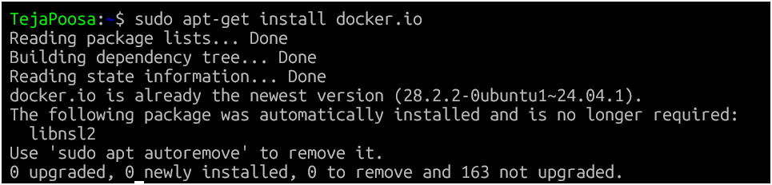
2. Verify the installation
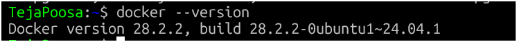
3. Run the `hello-world` container
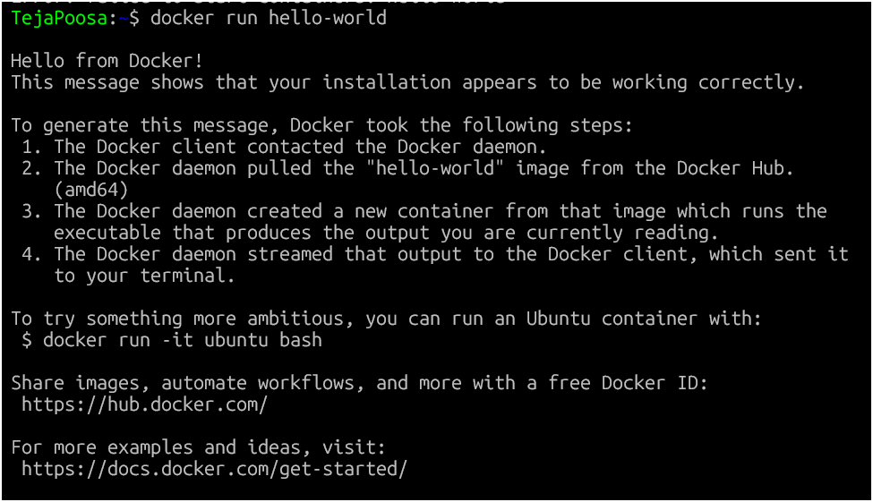
4. Read the output carefully — it explains what just happened

---

### Task 3: Run Real Containers
1. Run an **Nginx** container and access it in your browser
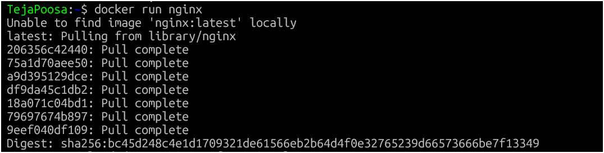
2. Run an **Ubuntu** container in interactive mode — explore
it like a mini Linux machine
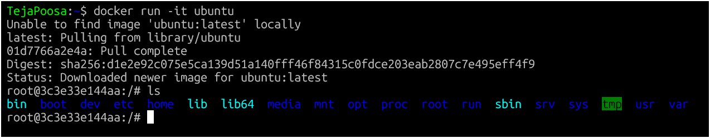
3. List all running containers
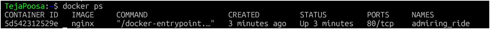
4. List all containers (including stopped ones)
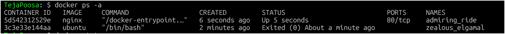
5. Stop and remove a container
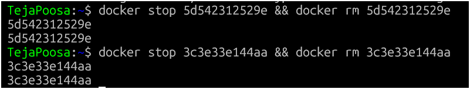
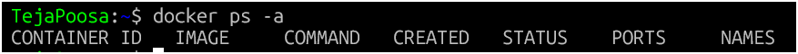
---

### Task 4: Explore
1. Run a container in **detached mode** — what's different?
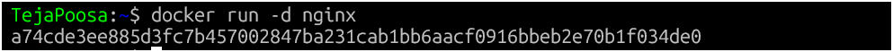
2. Give a container a custom **name**
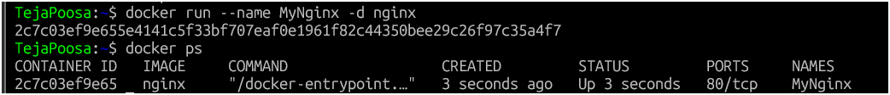
3. Map a **port** from the container to your host
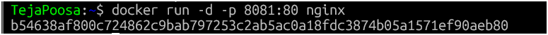
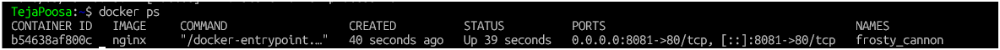
4. Check **logs** of a running container
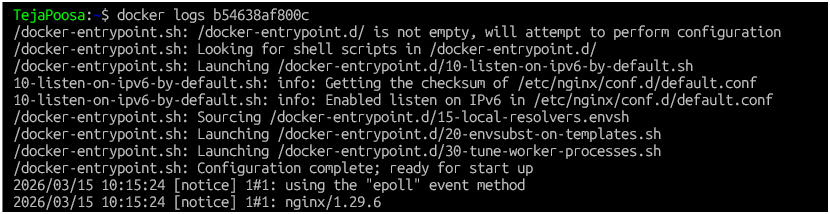
5. Run a command **inside** a running container
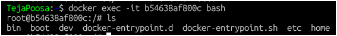

---

## Hints
- `docker run`, `docker ps`, `docker stop`, `docker rm`
- Interactive mode: `-it` flag
- Detached mode: `-d` flag
- Port mapping: `-p host:container`
- Naming: `--name`
- Logs: `docker logs`
- Exec into container: `docker exec`

---

## Why This Matters for DevOps
Docker is the foundation of modern deployment. Every CI/CD pipeline, Kubernetes cluster, and microservice architecture starts with containers. Today you took the first step.

## Learn in Public
Share your first Docker container screenshot on LinkedIn.

`#90DaysOfDevOps` `#DevOpsKaJosh` `#TrainWithShubham`

Happy Learning!
**TrainWithShubham**
