# Day 30 – Docker Images & Container Lifecycle

## Task
Today's goal is to **understand how images and containers actually work**.

You will:
- Learn the relationship between images and containers
- Understand image layers and caching
- Master the full container lifecycle
---

## Challenge Tasks

### Task 1: Docker Images
1. Pull the `nginx`, `ubuntu`, and `alpine` images from Docker Hub
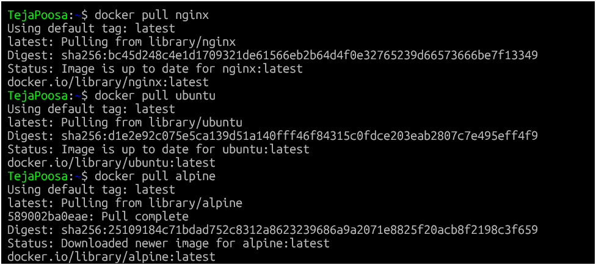
2. List all images on your machine — note the sizes
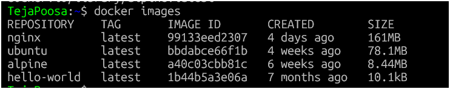
3. Compare `ubuntu` vs `alpine` — why is one much smaller?
   
| Image  | Size       | Reason                     |
|--------|------------|----------------------------|
| Ubuntu | Large      | Full OS Packages           |
| Alpine | Very small | Minimal Linux distribution |
| Nginx  | Medium     | Includes web server        |

Alpine is used in DevOps because:

- Fast download
- Small size
- Less storage
- Faster container start

4. Inspect an image — what information can you see?
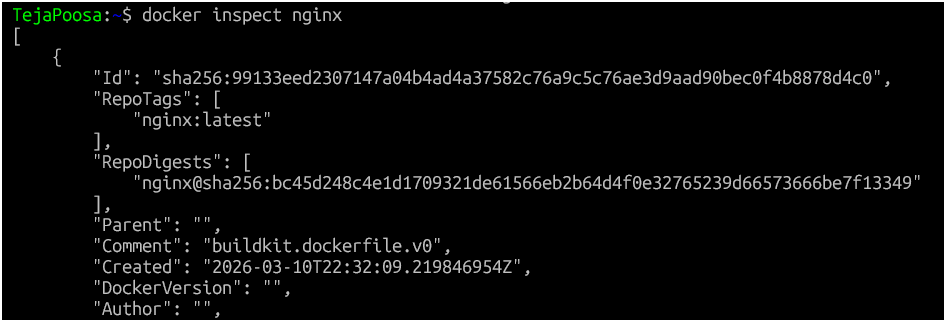
Information we can see:
- Image ID
- Layers
- Environment variables
- OS architecture
- Config
- Ports
5. Remove an image you no longer need
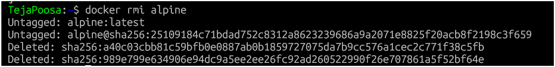
---

### Task 2: Image Layers
1. Run `docker image history nginx` — what do you see?

Output shows multiple lines.
Each line = one layer.
Some layers show size, some show 0B.

2. Each line is a **layer**. Note how some layers show sizes and some show 0B
3. Write in your notes: What are layers and why does Docker use them?

#### What are layers?

Docker images are built using layers.
Each command in Dockerfile creates a layer.

#### Example:
```
FROM ubuntu
RUN apt update
RUN apt install nginx
COPY . .
```
Each step = one layer.
#### Why layers are used
- Faster builds
- Caching
- Reuse layers
- Saves disk space
- Faster downloads

If one layer changes → only that layer rebuilds.
---

### Task 3: Container Lifecycle
Practice the full lifecycle on one container:
1. **Create** a container (without starting it)
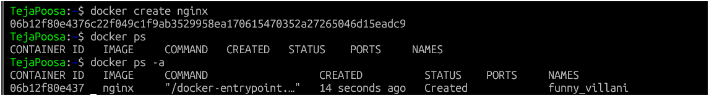
2. **Start** the container
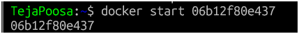
3. **Pause** it and check status
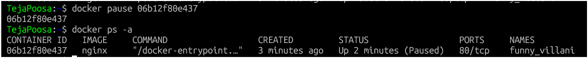
4. **Unpause** it
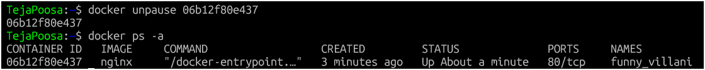
5. **Stop** it
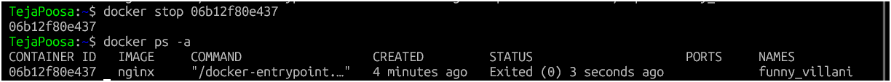
6. **Restart** it
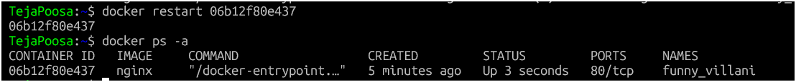
7. **Kill** it
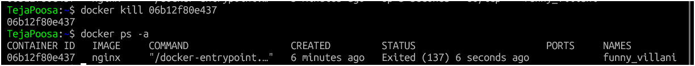
8. **Remove** it
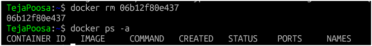

Check `docker ps -a` after each step — observe the state changes.

---

### Task 4: Working with Running Containers
1. Run an Nginx container in detached mode
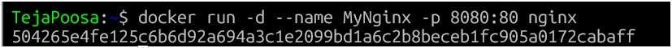
2. View its **logs**
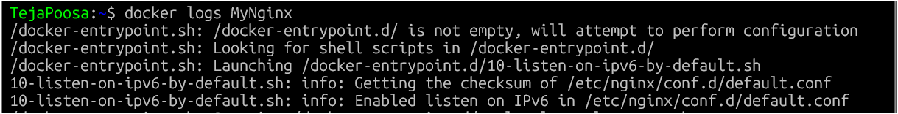

3. View **real-time logs** (follow mode)
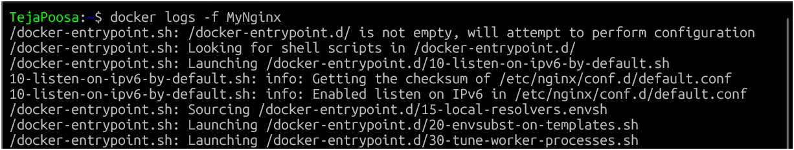
4. **Exec** into the container and look around the filesystem
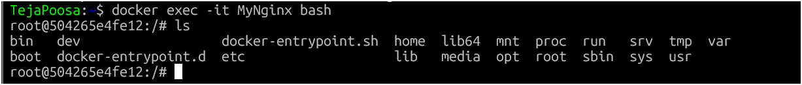
5. Run a single command inside the container without entering it
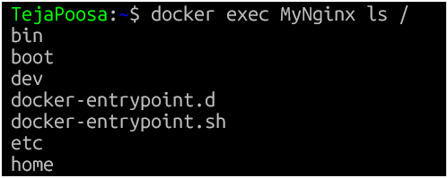
6. **Inspect** the container — find its IP address, port mappings, and mounts
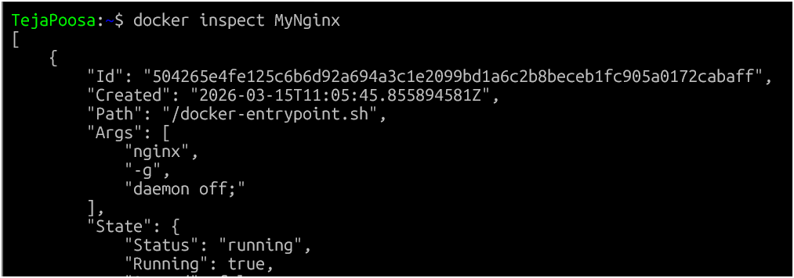

We can see:
- IP address
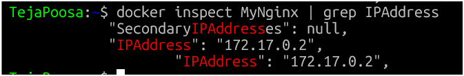
- Ports
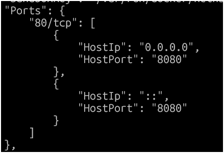
- Mounts

- Network
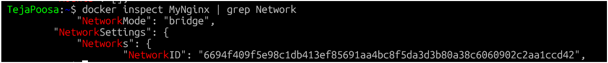
- Container ID
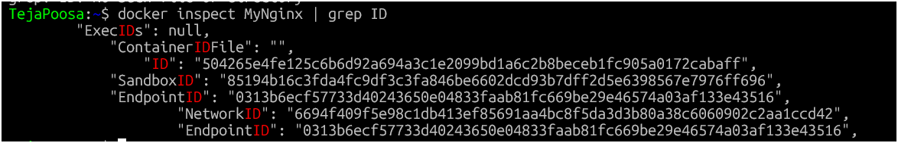
- Image used
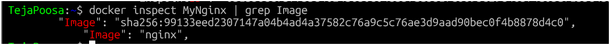
---

### Task 5: Cleanup
1. Stop all running containers in one command
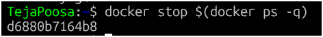
2. Remove all stopped containers in one command
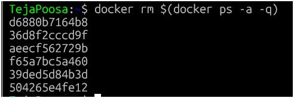
3. Remove unused images
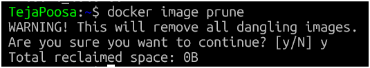
4. Check how much disk space Docker is using
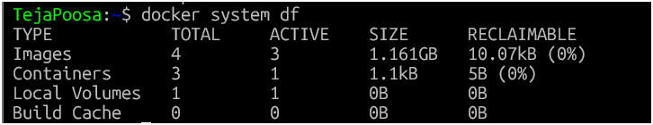
---

## Hints
- Image history: `docker image history`
- Create without starting: `docker create`
- Follow logs: `docker logs -f`
- Inspect: `docker inspect`
- Cleanup: `docker system df`, `docker system prune`

---

## Learn in Public
Share what surprised you about image layers or container states on LinkedIn.

`#90DaysOfDevOps` `#DevOpsKaJosh` `#TrainWithShubham`

Happy Learning!
**TrainWithShubham**
