# Day 32 – Docker Volumes & Networking

## Task
Today's goal is to **solve two real problems: data persistence and container communication**.

Containers are ephemeral — they lose data when removed. And by default, containers can't easily talk to each other. Today you fix both.

---

## Challenge Tasks

### Task 1: The Problem
1. Run a Postgres or MySQL container
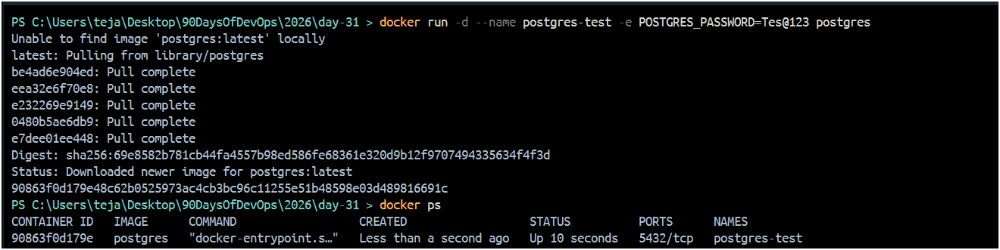
2. Create some data inside it (a table, a few rows — anything)
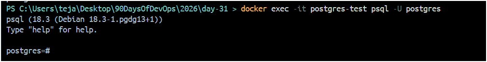
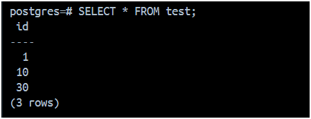
3. Stop and remove the container
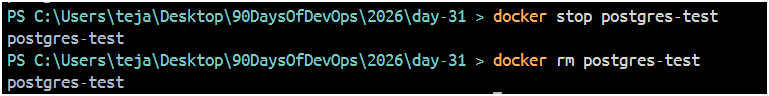
4. Run a new one — is your data still there?
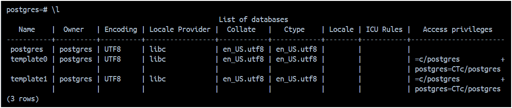
Write what happened and why.
#### Result
- Data was lost.
#### Why?
- Because container filesystem is temporary.
- When container is removed, data inside it is deleted.
---

### Task 2: Named Volumes
1. Create a named volume
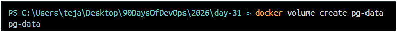
2. Run the same database container, but this time **attach the volume** to it
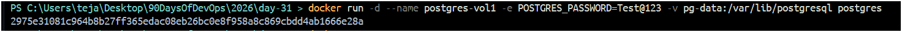
3. Add some data, stop and remove the container
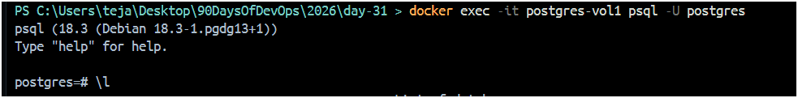
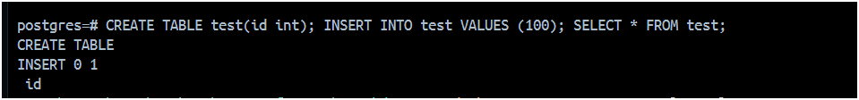
4. Run a brand new container with the **same volume**
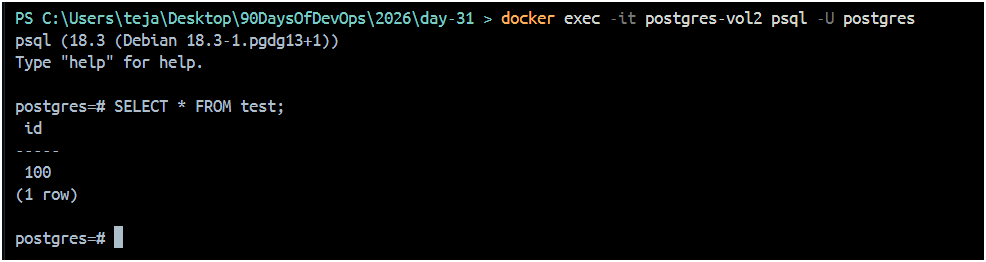
5. Is the data still there?
#### Result
- Data still exists

**Verify:** `docker volume ls`, `docker volume inspect`
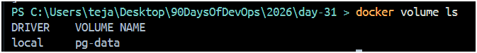
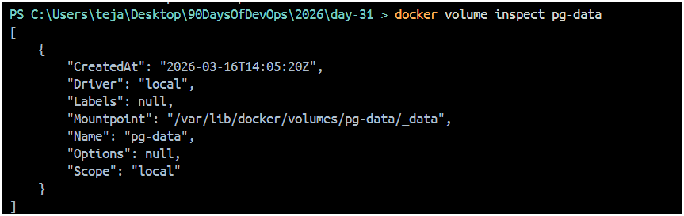

---

### Task 3: Bind Mounts
1. Create a folder on your host machine with an `index.html` file
2. Run an Nginx container and **bind mount** your folder to the Nginx web directory
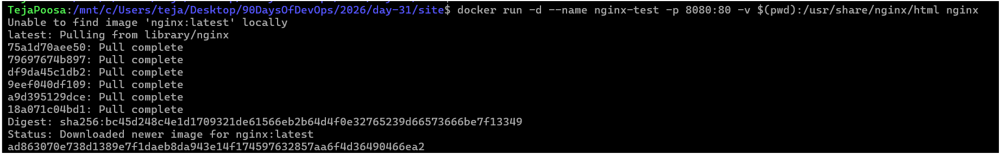
3. Access the page in your browser
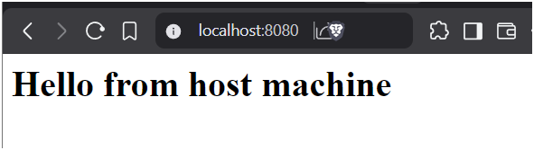
4. Edit the `index.html` on your host — refresh the browser

Write in your notes: What is the difference between a named volume and a bind mount?
| Feature                 | Named Volume | Bind Mount |
| ----------------------- | ------------ | ---------- |
| Managed by Docker       | Yes          | No         |
| Stored in Docker folder | Yes          | No         |
| Uses host folder        | No           | Yes        |
| Good for DB data        | Yes          | Sometimes  |
| Good for code/dev       | No           | Yes        |

---

### Task 4: Docker Networking Basics
1. List all Docker networks on your machine
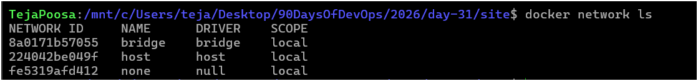
2. Inspect the default `bridge` network
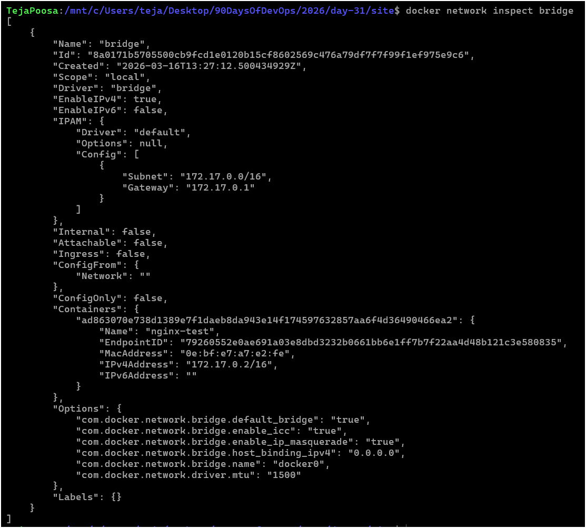
3. Run two containers on the default bridge — can they ping each other by **name**?
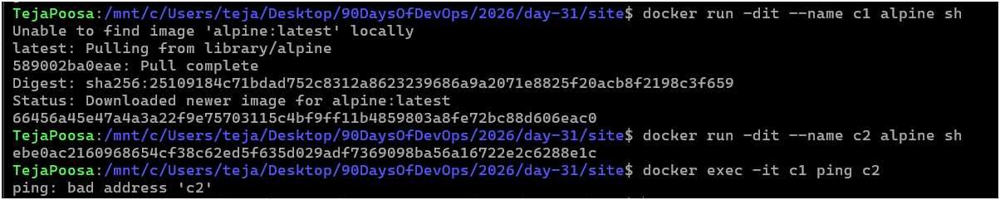
#### Result: Fails
4. Run two containers on the default bridge — can they ping each other by **IP**?
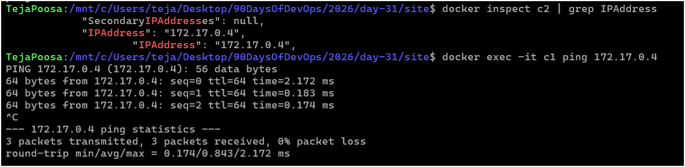
#### Result: Pass

---

### Task 5: Custom Networks
1. Create a custom bridge network called `my-app-net`
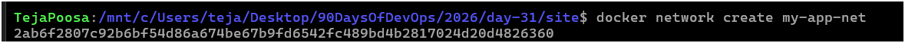
2. Run two containers on `my-app-net`
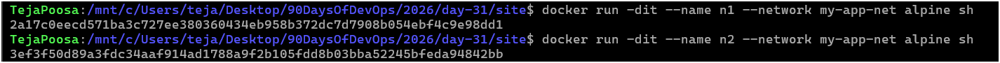
3. Can they ping each other by **name** now?
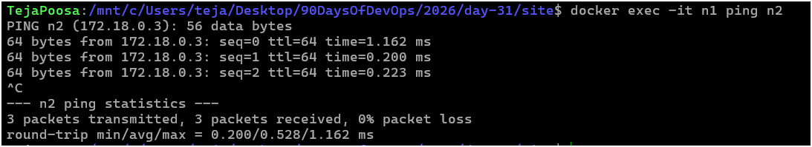
4. Write in your notes: Why does custom networking allow name-based communication but the default bridge doesn't?
#### Result:
Works ✅
#### Why?
- Custom bridge network has built-in DNS.
- Default bridge does not support name resolution.
---

### Task 6: Put It Together
1. Create a custom network

2. Run a **database container** (MySQL/Postgres) on that network with a volume for data
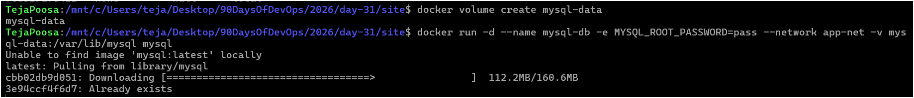
3. Run an **app container** (use any image) on the same network
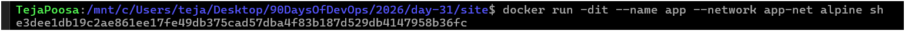
4. Verify the app container can reach the database by container name
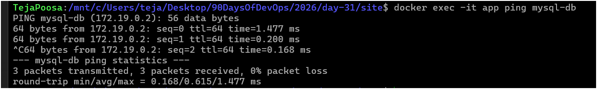
---

## Hints
- Volumes: `docker volume create`, `-v volume_name:/path`
- Bind mount: `-v /host/path:/container/path`
- Networking: `docker network create`, `--network`
- Ping: `docker exec container1 ping container2`

---

## Learn in Public
Share what happened when you deleted a container without a volume on LinkedIn. The "aha moment" is real.

`#90DaysOfDevOps` `#DevOpsKaJosh` `#TrainWithShubham`

Happy Learning!
**TrainWithShubham**
