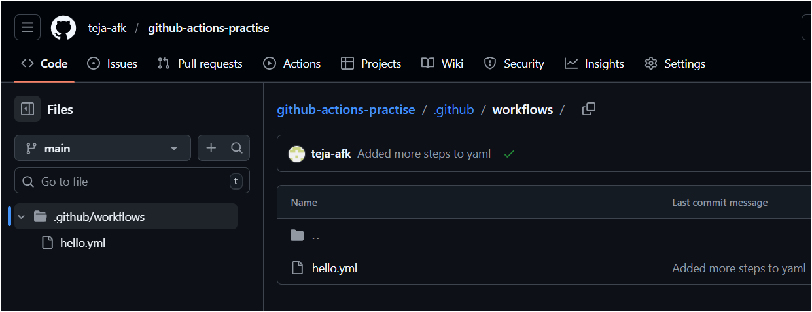
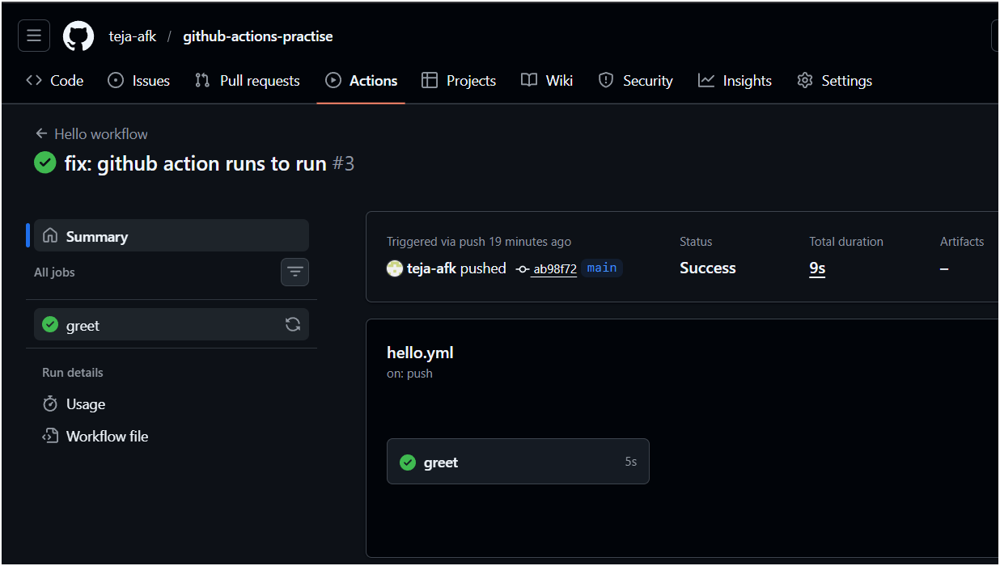
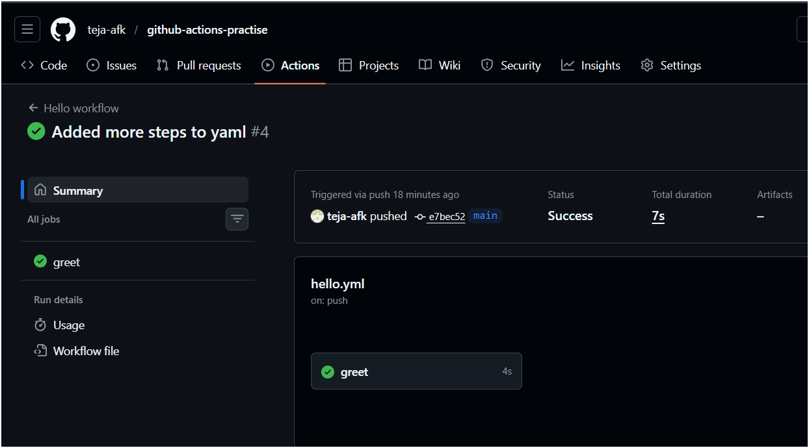
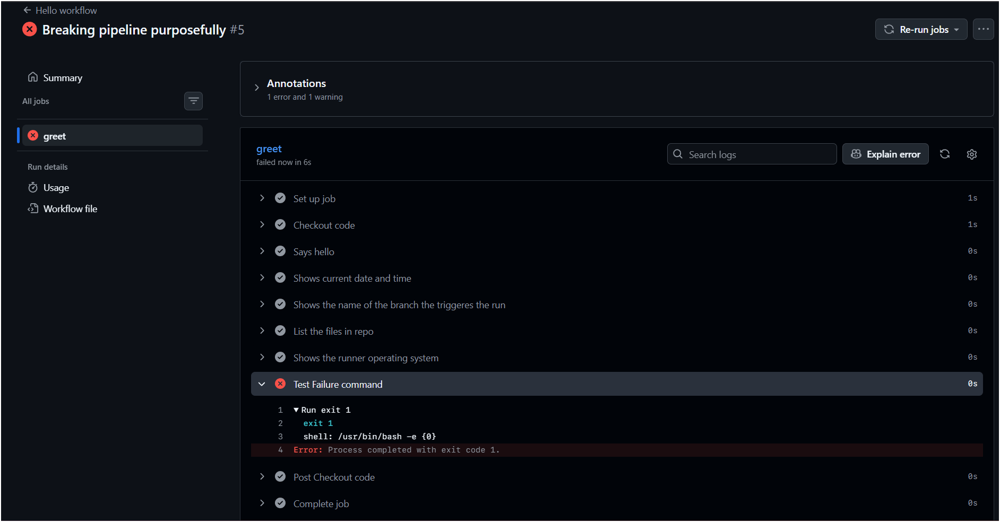

# Day 40 – Your First GitHub Actions Workflow

## Task
Today you write your **first GitHub Actions pipeline** and watch it run in the cloud.

This is the moment CI/CD stops being a concept and becomes real.

---

## Challenge Tasks

### Task 1: Set Up
1. Create a new **public** GitHub repository called `github-actions-practice`
2. Clone it locally
3. Create the folder structure: `.github/workflows/`



---

### Task 2: Hello Workflow
Create `.github/workflows/hello.yml` with a workflow that:
1. Triggers on every `push`
2. Has one job called `greet`
3. Runs on `ubuntu-latest`
4. Has two steps:
   - Step 1: Check out the code using `actions/checkout`
   - Step 2: Print `Hello from GitHub Actions!`

#### hello.yaml
```yaml
---
name: Hello workflow

on:
  push:
    branches: [main]

  workflow_dispatch:

jobs:
  greet:
    runs-on: ubuntu-latest

    steps:
      - name: Checkout code
        uses: actions/checkout@v4

      - name: Says hello
        run: echo "Hello from GitHUb Actions!"
```


---
### Task 3: Workflow Anatomy (My Notes)

#### on:
Defines when the workflow runs.
Example: `push`, `pull_request`, `schedule`.

#### jobs:
Defines the jobs to run in the workflow.

#### runs-on:
Defines which runner machine executes the job.
Example: `ubuntu-latest`

#### steps:
List of commands executed in order.

#### uses:
Used to call an existing GitHub Action.

#### run:
Runs shell command on runner.

#### name:
Gives label to step or workflow.

--------------------------------------------------

## What I Learned

1. GitHub Actions runs workflows automatically on push
2. Workflow files must be inside `.github/workflows/`
3. Each push creates a new pipeline run
4. Pipeline logs help debug errors
5. CI/CD becomes real when workflow runs successfully

---

### Task 4: Add More Steps
Update `hello.yml` to also:
1. Print the **current date** and **time**
2. Print the **name of the branch** that triggered the run (hint: GitHub provides this as a variable)
3. List the files in the repo
4. Print the runner's **operating system**

#### Updated yaml
```yaml
---
name: Hello workflow

on:
  push:
    branches: [main]

  workflow_dispatch:

jobs:
  greet:
    runs-on: ubuntu-latest

    steps:
      - name: Checkout code
        uses: actions/checkout@v4

      - name: Says hello
        run: echo "Hello from GitHUb Actions!"

      - name: Shows current date and time
        run: date

      - name: Shows the name of the branch the triggeres the run
        run: echo ${{ github.ref_name }}

      - name: List the files in repo
        run: ls

      - name: Shows the runner operating system
        run: uname -a
```
Push again — watch the new run.



---

### Task 5: Break It On Purpose
1. Add a step that runs a command that will **fail** (e.g., `exit 1` or a misspelled command)
2. Push and observe what happens in the Actions tab
3. Fix it and push again

#### Added breaking command
```yaml
 - name: Test Failure command
   run: exit 1
```



Write in your notes: What does a failed pipeline look like? How do you read the error?
- Go to Actions
- Now it should be ❌ RED
- Open log → see error
- This is real CI/CD debugging.
---

## Hints
- Workflow files live in `.github/workflows/` and must end in `.yml`
- `uses: actions/checkout@v4` checks out your code onto the runner
- `run:` executes shell commands
- GitHub provides built-in variables like `${{ github.ref_name }}` for branch name
- Every push triggers a new run — check the Actions tab

---

## Learn in Public
Share your first green pipeline screenshot on LinkedIn. That green checkmark hits different.

`#90DaysOfDevOps` `#DevOpsKaJosh` `#TrainWithShubham`

Happy Learning!
**TrainWithShubham**
