# Day 42 – Runners: GitHub-Hosted & Self-Hosted

## Task
Every job needs a machine to run on. Today you understand **runners** — GitHub's hosted ones and how to set up your own self-hosted runner on a real server.

---

## Challenge Tasks

### Task 1: GitHub-Hosted Runners
1. Create a workflow with 3 jobs, each on a different OS:
   - `ubuntu-latest`
   - `windows-latest`
   - `macos-latest`
2. In each job, print:
   - The OS name
   - The runner's hostname
   - The current user running the job
3. Watch all 3 run in parallel

```yaml
---
name: Runner OS Test

on:
  push:

jobs:
  ubuntu-job:
    runs-on: ubuntu-latest
    steps:
      - name: Print details
        run: |
          echo "OS: Ubuntu"
          hostname
          whoami

  macos-job:
    runs-on: macos-latest
    steps:
      - name: Print details
        run: |
          echo "OS: MacOS"
          hostname
          whoami

  windows-job:
    runs-on: windows-latest
    steps:
      - name: Print details
        run: |
          echo "OS: Windows"
          hostname
          whoami
```
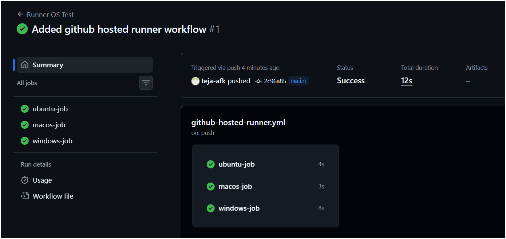

### Notes

#### What is a GitHub-hosted runner?

- A GitHub-hosted runner is a virtual machine provided by GitHub to run workflows.

#### Who manages it?

- GitHub manages the machine, OS, updates, and installed software.

---

### Task 2: Explore What's Pre-installed
1. On the `ubuntu-latest` runner, run a step that prints:
   - Docker version
   - Python version
   - Node version
   - Git version
2. Look up the GitHub docs for the full list of pre-installed software on `ubuntu-latest`

```yaml
---
name: Check Tools

on:
  push:

jobs:
  tools:
    runs-on: ubunutu-latest

    steps:
      - name: Check version
        run: |
          docker --version
          python3 --version
          node --version
          git --version
```
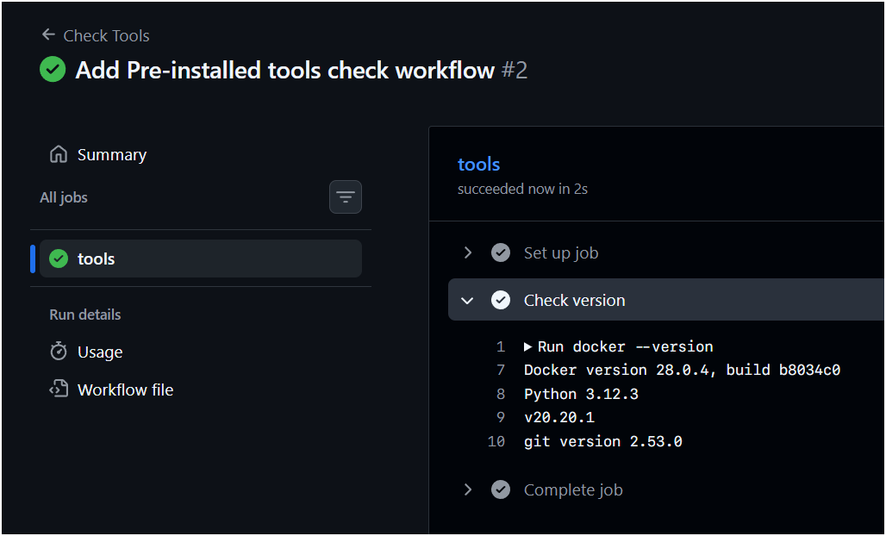

#### Notes

Why pre-installed tools matter:

- Faster workflow execution
- No need to install dependencies every time
- Standard environment
- Saves CI time

##### GitHub ubuntu runner already has:

- Docker
- Python
- Node
- Git
- Java
- Go
- Rust
- .NET
Many others
---

### Task 3: Set Up a Self-Hosted Runner
1. Go to your GitHub repo → Settings → Actions → Runners → **New self-hosted runner**
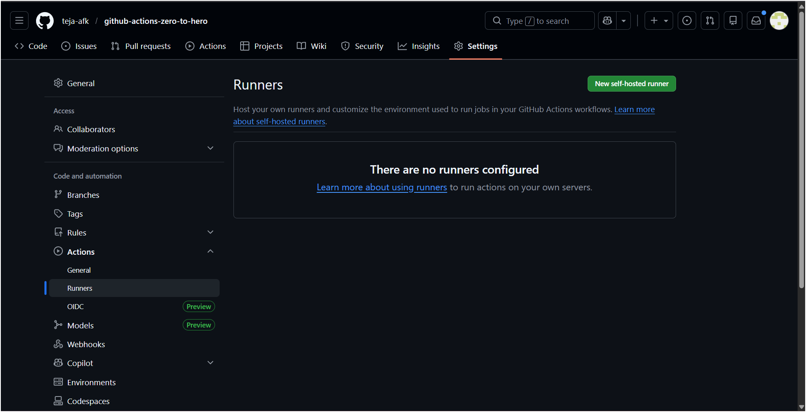
2. Choose Linux as the OS
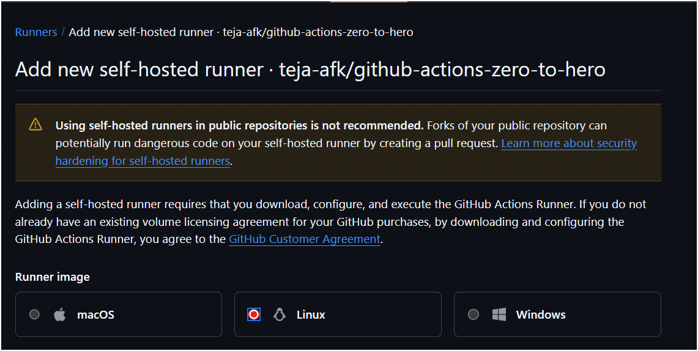
3. Follow the instructions to download and configure the runner on:
  - A cloud VM (EC2)
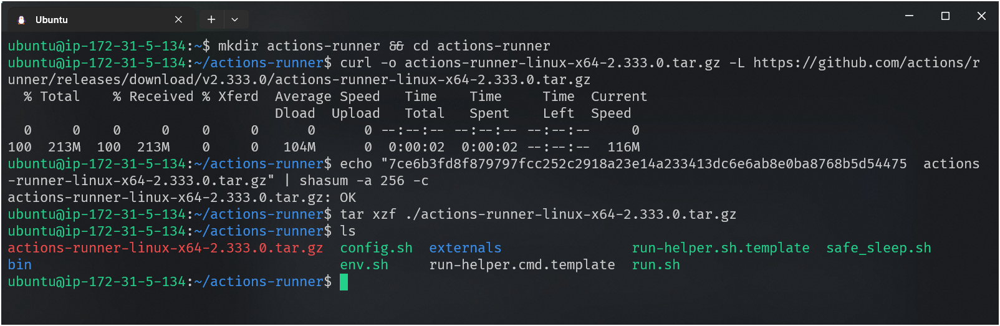
4. Start the runner — verify it shows as **Idle** in GitHub
./config.sh --url https://github.com/teja-afk/github-actions-zero-to-hero --token YOUR_TOKEN
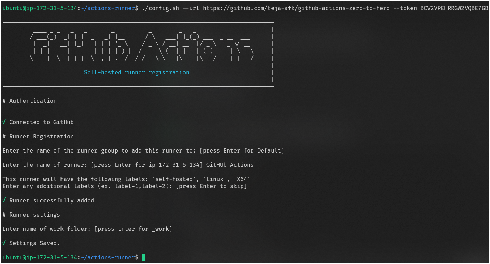
**Verify:** Your runner appears in the Runners list with a green dot.
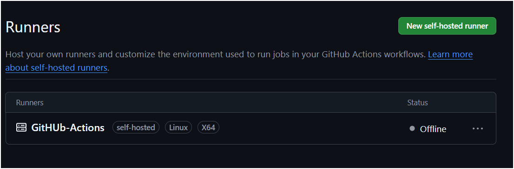
---

### Task 4: Use Your Self-Hosted Runner
1. Create `.github/workflows/self-hosted.yml`
2. Set `runs-on: self-hosted`
3. Add steps that:
   - Print the hostname of the machine (it should be YOUR machine/VM)
   - Print the working directory
   - Create a file and verify it exists on your machine after the run
4. Trigger it and watch it run on your own hardware

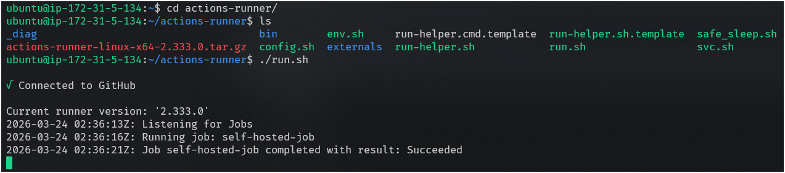
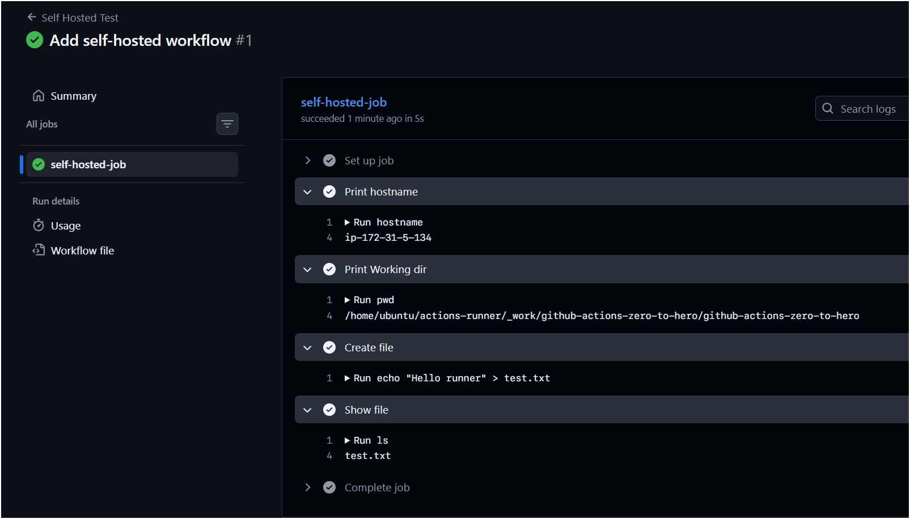

**Verify:** Check your machine — is the file there?
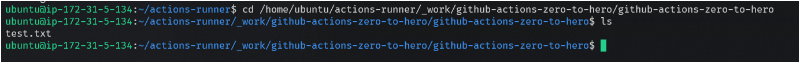

---

### Task 5: Labels
1. Add a **label** to your self-hosted runner (e.g., `my-linux-runner`)
2. Update your workflow to use `runs-on: [self-hosted, my-linux-runner]`
3. Trigger it — does it still pick up the job?

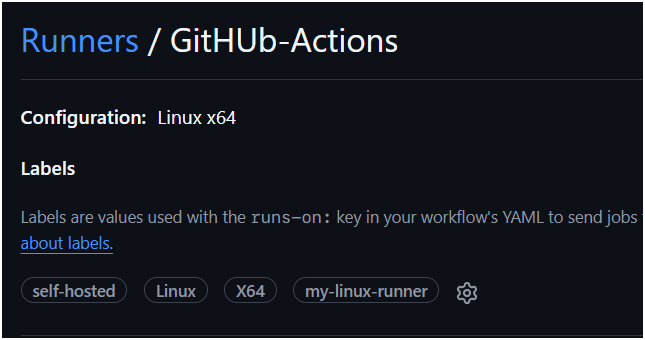

##### Notes
Why labels are useful:
- Select specific runner
- Useful with multiple runners
- Useful for GPU / Linux / Windows / High RAM runners
- Better job control
---

### Task 6: GitHub-Hosted vs Self-Hosted
Fill this in your notes:

| Feature             | GitHub-Hosted               | Self-Hosted                  |
| ------------------- | --------------------------- | ---------------------------- |
| Who manages it?     | GitHub                      | User                         |
| Cost                | Free (limited)              | User pays                    |
| Pre-installed tools | Yes                         | Depends on user              |
| Good for            | CI, testing, small projects | Custom builds, private infra |
| Security concern    | Low                         | Must secure yourself         |


---

## Hints
- Runner setup script is generated by GitHub — just copy and run it
- Self-hosted runner runs as a background service: `./run.sh`
- To run as a service (persistent): `sudo ./svc.sh install && sudo ./svc.sh start`
- `runs-on: self-hosted` targets any self-hosted runner
- `runs-on: [self-hosted, linux, my-label]` targets specific ones

---

## Learn in Public
Share your self-hosted runner screenshot on LinkedIn — running CI on your own machine is a cool flex.

`#90DaysOfDevOps` `#DevOpsKaJosh` `#TrainWithShubham`

Happy Learning!
**TrainWithShubham**
