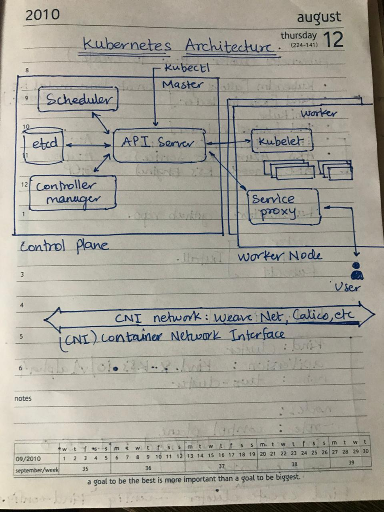
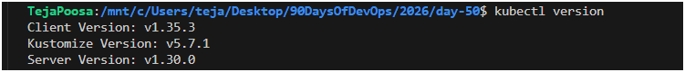
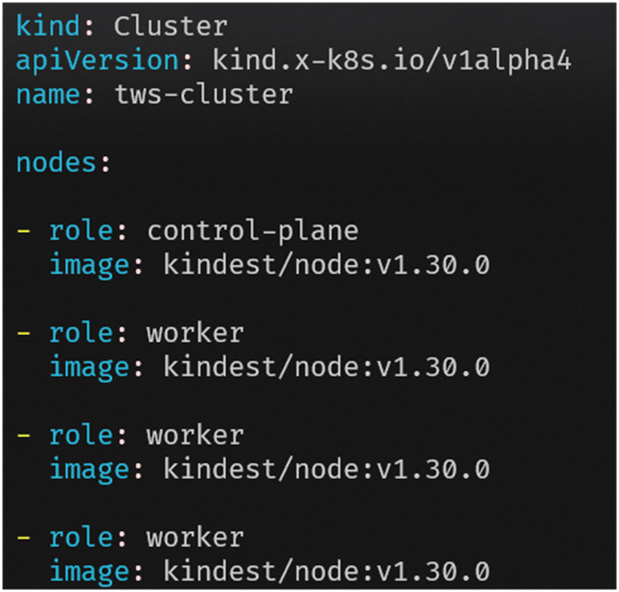
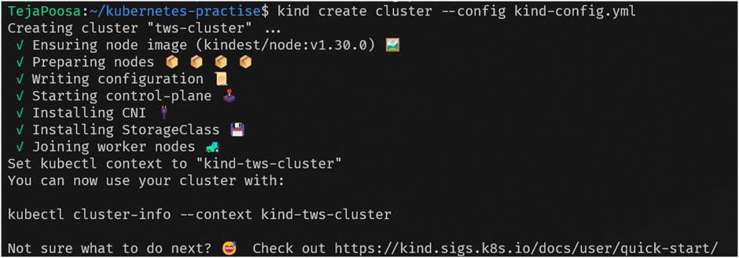
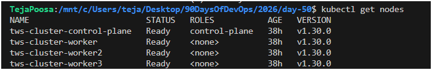
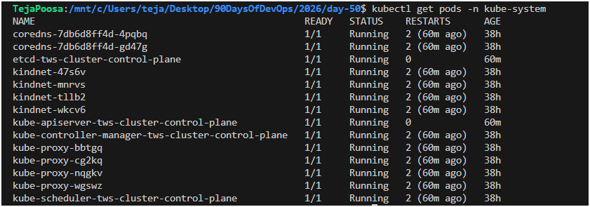

# Day 50 – Kubernetes Architecture and Cluster Setup 🚀
---
## Task

You have been building and shipping containers with Docker. But what happens when you need to run hundreds of containers across multiple servers? You need an orchestrator. Today you start your Kubernetes journey — understand the architecture, set up a local cluster, and run your first `kubectl` commands.

This is where things get real.

---

## Challenge Tasks

---

## Task 1: Kubernetes Story

### Why Kubernetes was created

Docker helps you run containers, but it does not handle orchestration at scale. When you have hundreds of containers across multiple machines, you need:

* Automatic scheduling
* Scaling
* Self-healing
* Load balancing

Kubernetes solves this by acting as a container orchestration platform.

---

### Who created Kubernetes and inspiration

Kubernetes was created by Google and inspired by Google’s internal system called Borg.

---

### Meaning of Kubernetes

“Kubernetes” is a Greek word meaning “helmsman” or “pilot”, symbolizing steering containers.

---

## Task 2: Kubernetes Architecture



### Control Plane (Master Node)

* **API Server**

  * Entry point for all cluster communication
  * Handles all REST operations

* **etcd**

  * Key-value store
  * Stores cluster state

* **Scheduler**

  * Assigns pods to nodes based on resources

* **Controller Manager**

  * Maintains desired state (self-healing)


---

### Worker Node

* **kubelet**

  * Communicates with API server
  * Manages containers on node

* **kube-proxy**

  * Handles networking and service routing

* **Container Runtime**

  * Runs containers (containerd, CRI-O)

---

### Architecture Flow

When running:

```bash
kubectl apply -f pod.yaml
```

Flow:

1. kubectl → API Server
2. API Server → stores state in etcd
3. Scheduler → assigns node
4. kubelet → pulls image & runs container
5. Controller Manager → ensures desired state

---

### Failure Scenarios

* **If API Server goes down**

  * Cluster becomes unmanageable (no new operations)

* **If Worker Node goes down**

  * Pods are automatically rescheduled to other nodes

---

## Task 3: Install kubectl

```bash
kubectl version --client
```

---

## Task 4: Local Cluster Setup

### Tool Used: kind

I chose kind (Kubernetes in Docker) because it is lightweight, fast, and integrates well with Docker. It is ideal for local development and DevOps practice since clusters can be created and deleted quickly.

---

### Create Cluster


```bash
kind create cluster --name devops-cluster
```



---

### Verify Cluster

```bash
kubectl cluster-info
kubectl get nodes
```

---

## Task 5: Explore Cluster

```bash
kubectl cluster-info
kubectl get nodes
kubectl describe node <node-name>
kubectl get namespaces
kubectl get pods -A
kubectl get pods -n kube-system
```

---

### kube-system Pods Explanation

* **etcd** → Stores cluster data
* **kube-apiserver** → API entry point
* **kube-scheduler** → Assigns pods
* **kube-controller-manager** → Maintains state
* **coredns** → DNS inside cluster
* **kube-proxy** → Networking

---

## Task 6: Cluster Lifecycle

```bash
kind delete cluster --name devops-cluster
kind create cluster --name devops-cluster
kubectl get nodes
```

---

### Useful Commands

```bash
kubectl config current-context
kubectl config get-contexts
kubectl config view
```

---

### What is kubeconfig?

kubeconfig is a configuration file used by kubectl to connect to Kubernetes clusters. It contains cluster details, user credentials, and context information.

Default location:

```
~/.kube/config
```

---

## Screenshots

### Cluster Nodes

```bash
kubectl get nodes
```


---

### kube-system Pods

```bash
kubectl get pods -n kube-system
```


---

## Summary

Today I started my Kubernetes journey by understanding its architecture and setting up a local cluster using kind. I explored the control plane and worker node components and observed how Kubernetes manages containers efficiently. This marks the beginning of container orchestration learning.

---

## Learn in Public

Started my Kubernetes journey today. Set up a local cluster, explored the architecture, and saw the control plane components running as actual pods. The orchestration chapter begins.

#90DaysOfDevOps #DevOpsKaJosh #TrainWithShubham

---
