# Day 52 – Kubernetes Namespaces and Deployments

## Task
Yesterday you created standalone Pods. The problem? Delete a Pod and it is gone forever — no one recreates it. Today you fix that with Deployments, the real way to run applications in Kubernetes. You will also learn Namespaces, which let you organize and isolate resources inside a cluster.

---

## Expected Output
- At least 2 namespaces created and used
- A Deployment running with multiple replicas
- A scaled Deployment and a rolling update performed
- A markdown file: `day-52-namespaces-deployments.md`
- Screenshot of `kubectl get deployments` and `kubectl get pods` across namespaces

---

## Challenge Tasks

### Task 1: Explore Default Namespaces
Kubernetes comes with built-in namespaces. List them:

📦 What are Namespaces?
Namespaces in Kubernetes act as logical partitions within a cluster.

🔹 Why use Namespaces?
Resource isolation between teams/environments
Avoid naming conflicts
Better resource management and access control

🔹 Default Namespaces
default → Default workspace
kube-system → Internal Kubernetes components
kube-public → Public resources
kube-node-lease → Node heartbeat tracking

```bash
kubectl get namespaces
```
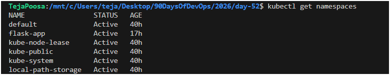

You should see at least:
- `default` — where your resources go if you do not specify a namespace
- `kube-system` — Kubernetes internal components (API server, scheduler, etc.)
- `kube-public` — publicly readable resources
- `kube-node-lease` — node heartbeat tracking

Check what is running inside `kube-system`:
```bash
kubectl get pods -n kube-system
```
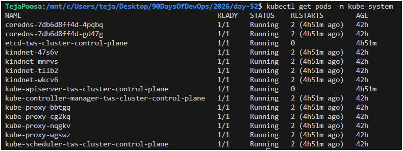

These are the control plane components keeping your cluster alive. Do not touch them.

**Verify:** How many pods are running in `kube-system`?
- 14
---

### Task 2: Create and Use Custom Namespaces
Create two namespaces — one for a development environment and one for staging:

```bash
kubectl create namespace dev
kubectl create namespace staging
```
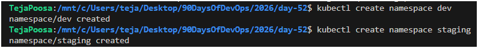
Verify they exist:
```bash
kubectl get namespaces
```
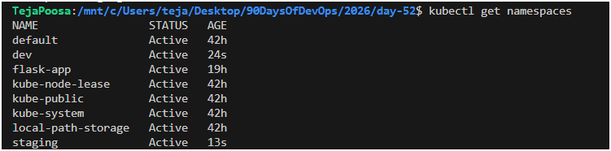
You can also create a namespace from a manifest:
```yaml
# namespace.yaml
apiVersion: v1
kind: Namespace
metadata:
  name: production
```

```bash
kubectl apply -f namespace.yaml
```
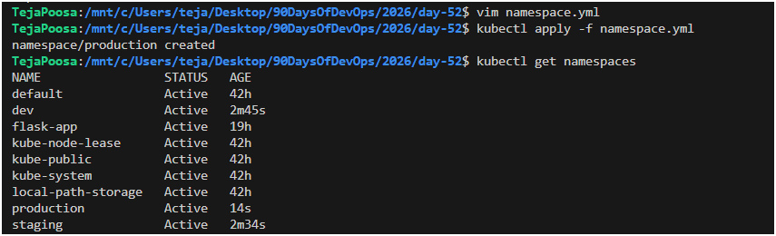

Now run a pod in a specific namespace:
```bash
kubectl run nginx-dev --image=nginx:latest -n dev
kubectl run nginx-staging --image=nginx:latest -n staging
```
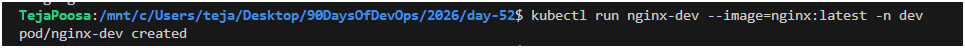
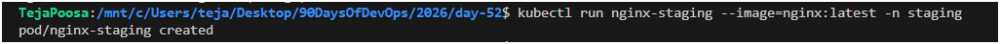
List pods across all namespaces:
```bash
kubectl get pods -A
```
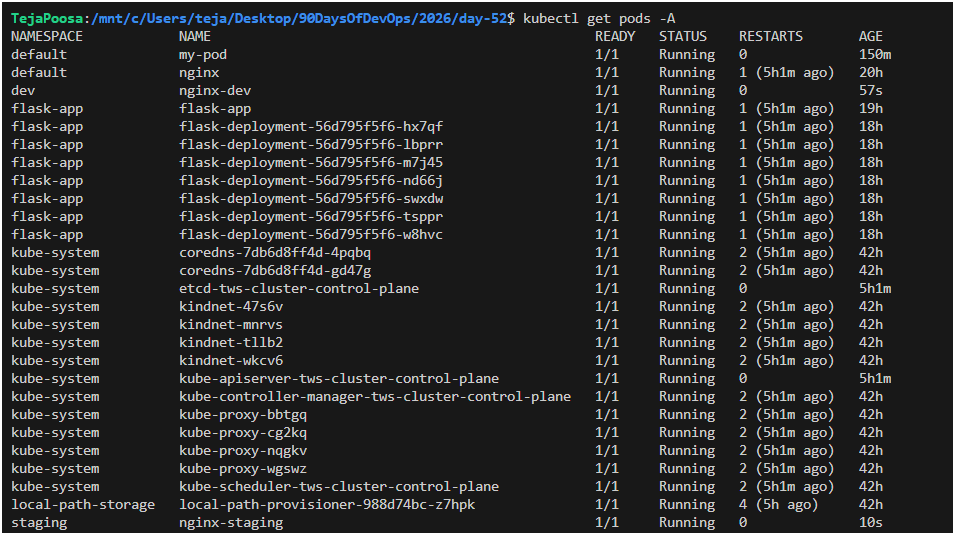

Notice that `kubectl get pods` without `-n` only shows the `default` namespace. You must specify `-n <namespace>` or use `-A` to see everything.

**Verify:** Does `kubectl get pods` show these pods? What about `kubectl get pods -A`?

---

### Task 3: Create Your First Deployment
A Deployment tells Kubernetes: "I want X replicas of this Pod running at all times." If a Pod crashes, the Deployment controller recreates it automatically.

#### A Deployment ensures:

Desired number of Pods are always running
Automatic recovery (self-healing)
Rolling updates and rollbacks

Create a file `nginx-deployment.yaml`:

```yaml
apiVersion: apps/v1
kind: Deployment
metadata:
  name: nginx-deployment
  namespace: dev
  labels:
    app: nginx
spec:
  replicas: 3
  selector:
    matchLabels:
      app: nginx
  template:
    metadata:
      labels:
        app: nginx
    spec:
      containers:
      - name: nginx
        image: nginx:1.24
        ports:
        - containerPort: 80
```

Key differences from a standalone Pod:
- `kind: Deployment` instead of `kind: Pod`
- `apiVersion: apps/v1` instead of `v1`
- `replicas: 3` tells Kubernetes to maintain 3 identical pods
- `selector.matchLabels` connects the Deployment to its Pods
- `template` is the Pod template — the Deployment creates Pods using this blueprint

Apply it:
```bash
kubectl apply -f nginx-deployment.yaml
```
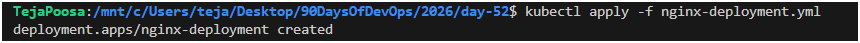
Check the result:
```bash
kubectl get deployments -n dev
kubectl get pods -n dev
```
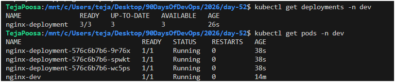

You should see 3 pods with names like `nginx-deployment-xxxxx-yyyyy`.

**Verify:** What do the READY, UP-TO-DATE, and AVAILABLE columns mean in the deployment output?
- READY → Running Pods / Desired Pods
- UP-TO-DATE → Pods updated to latest spec
- AVAILABLE → Pods available to serve traffic
---

### Task 4: Self-Healing — Delete a Pod and Watch It Come Back

Kubernetes automatically creates a new Pod.

🔹 Key Insight:
New Pod has a different name
Deployment ensures desired state is maintained


This is the key difference between a Deployment and a standalone Pod.
| Feature           | Pod               | Deployment          |
| ----------------- | ----------------- | ------------------- |
| Self-healing      | ❌ No              | ✅ Yes               |
| Scaling           | ❌ Manual          | ✅ Automatic         |
| Rolling updates   | ❌ No              | ✅ Yes               |
| Use in production | ❌ Not recommended | ✅ Standard practice |


```bash
# List pods
kubectl get pods -n dev

# Delete one of the deployment's pods (use an actual pod name from your output)
kubectl delete pod <pod-name> -n dev

# Immediately check again
kubectl get pods -n dev
```
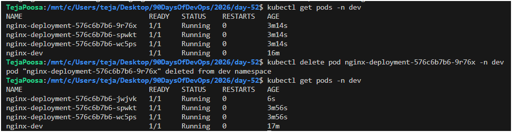
The Deployment controller detects that only 2 of 3 desired replicas exist and immediately creates a new one. The deleted pod is replaced within seconds.

**Verify:** Is the replacement pod's name the same as the one you deleted, or different?
- different
---

### Task 5: Scale the Deployment
Change the number of replicas:

```bash
# Scale up to 5
kubectl scale deployment nginx-deployment --replicas=5 -n dev
kubectl get pods -n dev
```
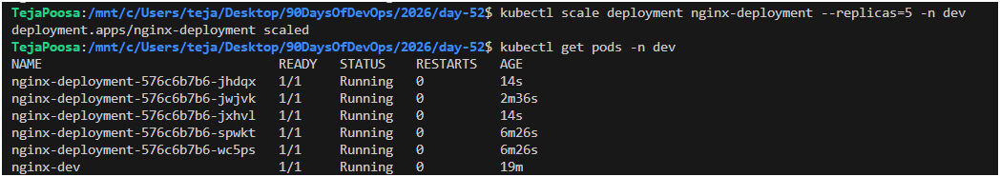
```bash
# Scale down to 2
kubectl scale deployment nginx-deployment --replicas=2 -n dev
kubectl get pods -n dev
```
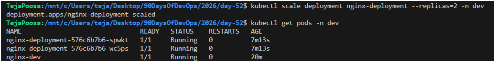

Watch how Kubernetes creates or terminates pods to match the desired count.

You can also scale by editing the manifest — change `replicas: 4` in your YAML file and run `kubectl apply -f nginx-deployment.yaml` again.

**Verify:** When you scaled down from 5 to 2, what happened to the extra pods?
- Extra Pods are terminated gracefully
---

### Task 6: Rolling Update
Update the Nginx image version to trigger a rolling update:

```bash
kubectl set image deployment/nginx-deployment nginx=nginx:1.25 -n dev
```
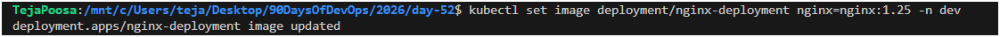
Watch the rollout in real time:
```bash
kubectl rollout status deployment/nginx-deployment -n dev
```
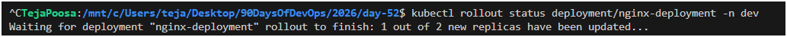
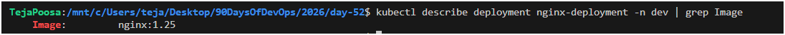
Kubernetes replaces pods one by one — old pods are terminated only after new ones are healthy. This means zero downtime.

Check the rollout history:
```bash
kubectl rollout history deployment/nginx-deployment -n dev
```
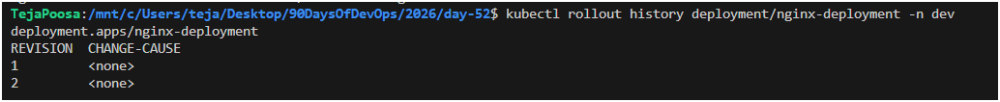
Now roll back to the previous version:
```bash
kubectl rollout undo deployment/nginx-deployment -n dev
kubectl rollout status deployment/nginx-deployment -n dev
```
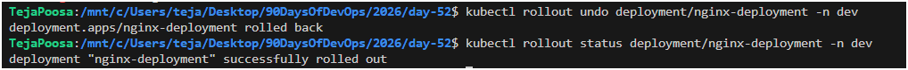
Verify the image is back to the previous version:
```bash
kubectl describe deployment nginx-deployment -n dev | grep Image
```
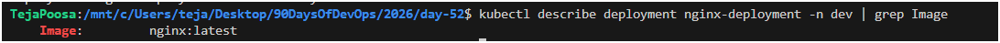
**Verify:** What image version is running after the rollback?

- Deployment returns to previous version (nginx:1.24 -> latest)
---

### Task 7: Clean Up
```bash
kubectl delete deployment nginx-deployment -n dev
kubectl delete pod nginx-dev -n dev
kubectl delete pod nginx-staging -n staging
kubectl delete namespace dev staging production
```
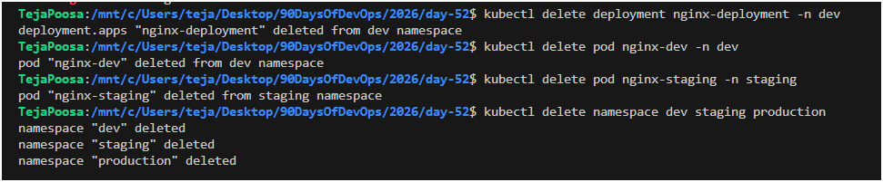
Deleting a namespace removes everything inside it. Be very careful with this in production.

```bash
kubectl get namespaces
kubectl get pods -A
```

**Verify:** Are all your resources gone?
- Deleting a namespace removes all resources inside it
---

## Hints
- `kubectl get <resource> -n <namespace>` — target a specific namespace
- `kubectl get <resource> -A` — list resources across all namespaces
- `selector.matchLabels` in a Deployment must match `template.metadata.labels` — if they do not match, the Deployment will not manage the Pods
- `kubectl scale deployment <name> --replicas=N` — quick way to scale
- `kubectl set image` updates a container image without editing the YAML
- `kubectl rollout undo` rolls back to the previous revision
- `kubectl rollout history` shows past revisions of a Deployment
- Deployments create ReplicaSets behind the scenes — you can see them with `kubectl get replicasets -n <namespace>`

---


## Learn in Public
Share on LinkedIn: "Learned Kubernetes Namespaces and Deployments today. Created self-healing deployments, scaled them up and down, and performed a zero-downtime rolling update with rollback."

`#90DaysOfDevOps` `#DevOpsKaJosh` `#TrainWithShubham`

Happy Learning!
**TrainWithShubham**
