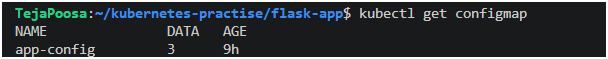
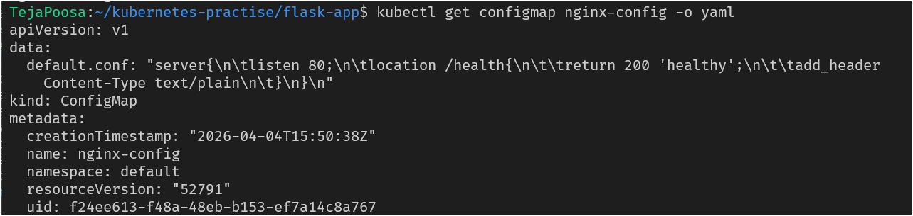
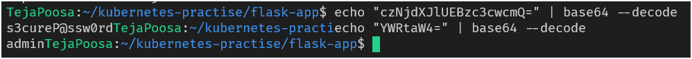
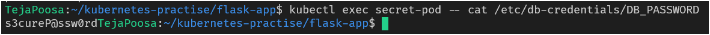
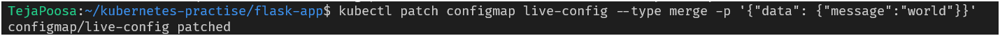

# Day 54 – Kubernetes ConfigMaps and Secrets

## Task
Your application needs configuration — database URLs, feature flags, API keys. Hardcoding these into container images means rebuilding every time a value changes. Kubernetes solves this with ConfigMaps for non-sensitive config and Secrets for sensitive data.

---

## Challenge Tasks

### Task 1: Create a ConfigMap from Literals

#### 🔹 What are ConfigMaps?

A ConfigMap is a Kubernetes object used to store non-sensitive configuration data as key-value pairs.

#### ✅ Use Cases
- Environment variables (APP_ENV, PORT)
- Configuration files (Nginx, app configs)
- Feature flags
#### 📌 Key Characteristics
- Stored as plain text
- No encryption by default
- Can be consumed as:
  - Environment variables
  - Volume-mounted files

---

1. Use `kubectl create configmap` with `--from-literal` to create a ConfigMap called `app-config` with keys `APP_ENV=production`, `APP_DEBUG=false`, and `APP_PORT=8080`
2. Inspect it with `kubectl describe configmap app-config` and `kubectl get configmap app-config -o yaml`
3. Notice the data is stored as plain text — no encoding, no encryption

**Verify:** Can you see all three key-value pairs?


---

### Task 2: Create a ConfigMap from a File
1. Write a custom Nginx config file that adds a `/health` endpoint returning "healthy"
2. Create a ConfigMap from this file using `kubectl create configmap nginx-config --from-file=default.conf=<your-file>`
3. The key name (`default.conf`) becomes the filename when mounted into a Pod

**default.conf**
```bash
server{
        listen 80;
        location /health{
                return 200 'healthy';
                add_header Content-Type text/plain
        }
}
```

**Verify:** Does `kubectl get configmap nginx-config -o yaml` show the file contents?



✅ Observation
File content stored inside ConfigMap
Key name becomes filename when mounted

---

### Task 3: Use ConfigMaps in a Pod
1. Write a Pod manifest that uses `envFrom` with `configMapRef` to inject all keys from `app-config` as environment variables. Use a busybox container that prints the values.
2. Write a second Pod manifest that mounts `nginx-config` as a volume at `/etc/nginx/conf.d`. Use the nginx image.
3. Test that the mounted config works: `kubectl exec <pod> -- curl -s http://localhost/health`

Use environment variables for simple key-value settings. Use volume mounts for full config files.

#### env-pod.yml
```yaml
apiVersion: v1
kind: Pod
metadata:
  name: env-pod
spec:
  container:
  - name: busybox
    image: busybox
    command: ["sh", "-c", "env && sleep 3600"]
    envFrom:
    - configMapRef:
        name: app-config
```


**Verify:** Does the `/health` endpoint respond?

✅ Output
```healthy```

---

### Task 4: Create a Secret
1. Use `kubectl create secret generic db-credentials` with `--from-literal` to store `DB_USER=admin` and `DB_PASSWORD=s3cureP@ssw0rd`
#### db-credentials.yml
```yaml
apiVersion: v1
data:
  DB_PASSWORD: czNjdXJlUEBzc3cwcmQ=
  DB_USER: YWRtaW4=
kind: Secret
metadata:
  creationTimestamp: "2026-04-05T05:00:00Z"
  name: db-credentials
  namespace: default
  resourceVersion: "61668"
  uid: 4b1971da-bf0d-4e7e-bc38-4287dad67026
type: Opaque
```

2. Inspect with `kubectl get secret db-credentials -o yaml` — the values are base64-encoded
3. Decode a value: `echo '<base64-value>' | base64 --decode`


**base64 is encoding, not encryption.** Anyone with cluster access can decode Secrets. The real advantages are RBAC separation, tmpfs storage on nodes, and optional encryption at rest.

**Verify:** Can you decode the password back to plaintext?
- yes

✅ Observation
Values are base64 encoded
Easily decoded → NOT secure encryption

---

### Task 5: Use Secrets in a Pod
1. Write a Pod manifest that injects `DB_USER` as an environment variable using `secretKeyRef`
2. In the same Pod, mount the entire `db-credentials` Secret as a volume at `/etc/db-credentials` with `readOnly: true`
3. Verify: each Secret key becomes a file, and the content is the decoded plaintext value

#### secret-pod.yml
```yaml
apiVersion: v1
kind: Pod
metadata:
  name: secret-pod
spec:
  containers:
  - name: busybox
    image: busybox
    command: ["sh", "-c", "env && sleep 3600"]
    env:
    - name: DB_USER
      valueFrom:
        secretKeyRef:
          name: db-credentials
          key: DB_USER
    volumeMounts:
    - name: secret-volume
      mountPath: /etc/db-credentials
      readOnly: true
  volumes:
  - name: secret-volume
    secret:
      secretName: db-credentials
```

**Verify:** Are the mounted file values plaintext or base64?


✅ Observation
Files contain decoded plaintext
Not base64 inside container

---

### Task 6: Update a ConfigMap and Observe Propagation
1. Create a ConfigMap `live-config` with a key `message=hello`
2. Write a Pod that mounts this ConfigMap as a volume and reads the file in a loop every 5 seconds
3. Update the ConfigMap: `kubectl patch configmap live-config --type merge -p '{"data":{"message":"world"}}'`
4. Wait 30-60 seconds — the volume-mounted value updates automatically
5. Environment variables from earlier tasks do NOT update — they are set at pod startup only

#### live-pod.yml
```yaml
apiVersion: v1
kind: Pod
metadata:
  name: live-pod
spec:
  containers:
  - name: busybox
    image: busybox
    command: ["sh", "-c", "while true; do cat /config/message; sleep 5; done"]
    volumeMounts:
    - name: config-volume
      mountPath: /config
  volumes:
  - name: config-volume
    configMap:
      name: live-config
```

**Verify:** Did the volume-mounted value change without a pod restart?
- yes

✅ Observation
File updates automatically (30–60 sec)
No pod restart required
Env variables DO NOT update

---

### Task 7: Clean Up
Delete all pods, ConfigMaps, and Secrets you created.

```yaml
kubectl delete pod env-pod nginx-pod secret-pod live-pod
kubectl delete configmap app-config nginx-config live-config
kubectl delete secret db-credentials
```

---

### 📊 Conceptual Understanding
🔸 **ConfigMaps vs Secrets**
| Feature   | ConfigMap     | Secret                     |
| --------- | ------------- | -------------------------- |
| Data Type | Non-sensitive | Sensitive                  |
| Storage   | Plain text    | Base64 encoded             |
| Security  | No protection | RBAC + optional encryption |
| Use Case  | App configs   | Credentials                |

🔸 **Env Variables vs Volume Mounts**
| Parameter        | Environment Variables | Volume Mounts |
| ---------------- | --------------------- | ------------- |
| Access Method    | env                   | file system   |
| Update Behavior  | Static                | Dynamic       |
| Best For         | Simple key-values     | Config files  |
| Restart Required | Yes                   | No            |

🔐 **Why Base64 is NOT Encryption**
- Base64 is encoding, not encryption
- Anyone can decode easily:
```bash
echo 'encoded' | base64 --decode
```

- Real security comes from:
  - RBAC (access control)
  - Encryption at rest (optional in cluster)

🔄 **ConfigMap Update Behavior**
| Method        | Updates Automatically? |
| ------------- | ---------------------- |
| Env Variables | ❌ No                   |
| Volume Mounts | ✅ Yes                  |

🚀 **Key Takeaways**
- ConfigMaps → for non-sensitive configuration
- Secrets → for sensitive data
- Use env variables for simple configs
- Use volume mounts for dynamic configs
- Base64 ≠ security
- Volume-mounted configs auto-update

---

## Hints
- `--from-literal=KEY=VALUE` for command-line values, `--from-file=key=filename` for file contents
- `envFrom` injects all keys; `env` with `valueFrom` injects individual keys
- `echo -n 'value' | base64` — always use `-n` to avoid encoding a trailing newline
- Volume-mounted ConfigMaps/Secrets auto-update; environment variables do not
- `kubectl get secret <name> -o jsonpath='{.data.KEY}' | base64 --decode` extracts and decodes a value

---


## Learn in Public
Share on LinkedIn: "Learned Kubernetes ConfigMaps and Secrets today. Injected config as environment variables and volume mounts, and discovered that base64 encoding is not encryption."

`#90DaysOfDevOps` `#DevOpsKaJosh` `#TrainWithShubham`

Happy Learning!
**TrainWithShubham**
