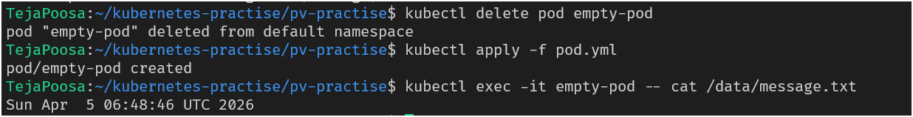
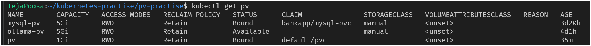
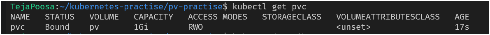
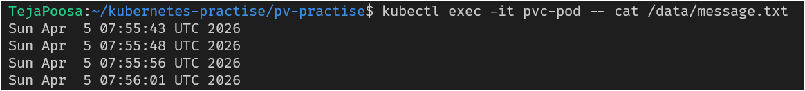
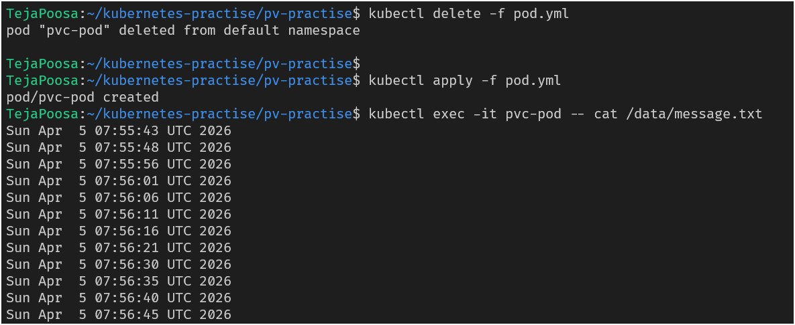
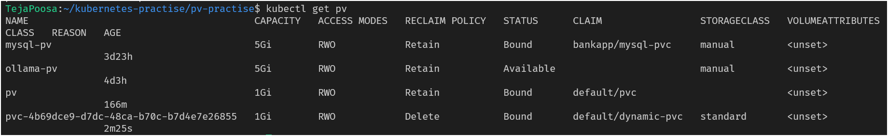
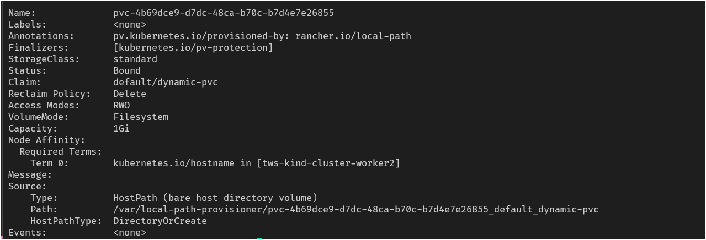

# Day 55 – Persistent Volumes (PV) and Persistent Volume Claims (PVC)

## Task
Containers are ephemeral — when a Pod dies, everything inside it disappears. That is a serious problem for databases and anything that needs to survive a restart. Today you fix this with Persistent Volumes and Persistent Volume Claims.

---

## Expected Output
- Data loss demonstrated with an ephemeral Pod
- A PV and PVC created, bound, and data persisting across Pod deletions
- A markdown file: `day-55-persistent-volumes.md`

---

## Challenge Tasks

### Task 1: See the Problem — Data Lost on Pod Deletion
1. Write a Pod manifest that uses an `emptyDir` volume and writes a timestamped message to `/data/message.txt`
2. Apply it, verify the data exists with `kubectl exec`

3. Delete the Pod, recreate it, check the file again — the old message is gone

**Verify:** Is the timestamp the same or different after recreation?
- Data change

`emptyDir` is an ephemeral volume tied to the Pod lifecycle. When the Pod is deleted, the volume and all its data are removed. Upon recreating the Pod, Kubernetes creates a new emptyDir volume, so previous data is lost and a new timestamp is generated.

#### 🔥 Key Insight (VERY IMPORTANT)

This is why:

❌ You cannot use emptyDir for databases
❌ Logs and user data will be lost
❌ Not suitable for production stateful apps

---

### Task 2: Create a PersistentVolume (Static Provisioning)
1. Write a PV manifest with `capacity: 1Gi`, `accessModes: ReadWriteOnce`, `persistentVolumeReclaimPolicy: Retain`, and `hostPath` pointing to `/tmp/k8s-pv-data`
2. Apply it and check `kubectl get pv` — status should be `Available`

Access modes to know:
- `ReadWriteOnce (RWO)` — read-write by a single node
- `ReadOnlyMany (ROX)` — read-only by many nodes
- `ReadWriteMany (RWX)` — read-write by many nodes

`hostPath` is fine for learning, not for production.


#### pv.yml
```yaml
apiVersion: v1
kind: PersistentVolume
metadata:
  name: pv
spec:
  capacity:
    storage: 1Gi
  accessModes:
    - ReadWriteOnce
  persistentVolumeReclaimPolicy: Retain
  hostPath:
    path: /tmp/k8s-pv-data
```

**Verify:** What is the STATUS of the PV?



---

### Task 3: Create a PersistentVolumeClaim
1. Write a PVC manifest requesting `500Mi` of storage with `ReadWriteOnce` access
2. Apply it and check both `kubectl get pvc` and `kubectl get pv`
3. Both should show `Bound` — Kubernetes matched them by capacity and access mode

#### pvc.yml

```yaml
apiVersion: v1
kind: PersistentVolumeClaim
metadata:
  name: pvc
spec:
  storageClassName: ""
  accessModes:
    - ReadWriteOnce
  resources:
    requests:
```

**Verify:** What does the VOLUME column in `kubectl get pvc` show?



---

### Task 4: Use the PVC in a Pod — Data That Survives
1. Write a Pod manifest that mounts the PVC at `/data` using `persistentVolumeClaim.claimName`
2. Write data to `/data/message.txt`, then delete and recreate the Pod
3. Check the file — it should contain data from both Pods

#### pvc-pod.yml
```yaml
apiVersion: v1
kind: Pod
metadata:
  name: pvc-pod
spec:
  containers:
  - name: busybox
    image: busybox
    command: ["sh", "-c", "while true; do date >> /data/message.txt; sleep 5; done"]
    volumeMounts:
    - mountPath: /data
      name: pv
  volumes:
  - name: pv
    persistentVolumeClaim:
      claimName: pvc
```

**Verify:** Does the file contain data from both the first and second Pod?


#### Test: Delete and create pvc-pod again


---

### Task 5: StorageClasses and Dynamic Provisioning
1. Run `kubectl get storageclass` and `kubectl describe storageclass`
2. Note the provisioner, reclaim policy, and volume binding mode
3. With dynamic provisioning, developers only create PVCs — the StorageClass handles PV creation automatically

**Verify:** What is the default StorageClass in your cluster?



---

### Task 6: Dynamic Provisioning
1. Write a PVC manifest that includes `storageClassName: standard` (or your cluster's default)
2. Apply it — a PV should appear automatically in `kubectl get pv`
3. Use this PVC in a Pod, write data, verify it works

#### dynamic-pvc.yml
```yaml
apiVersion: v1
kind: PersistentVolumeClaim
metadata:
  name: dynamic-pvc
spec:
  accessModes:
  - ReadWriteOnce
  resources:
    requests:
      storage: 1Gi
  storageClassName: standard
```

#### dynamic-pvc-pod.yml
```yaml
apiVersion: v1
kind: Pod
metadata:
  name: dynamic-pvc-pod
spec:
  containers:
  - name: busybox
    image: busybox
    command: ["sh", "-c", "while true; do date >> /data/message.txt; sleep 5; done"]
    volumeMounts:
    - mountPath: /data
      name: dynamic-pvc
  volumes:
  - name: dynamic-pvc
    persistentVolumeClaim:
      claimName: dynamic-pvc
```

**Verify:** How many PVs exist now? Which was manual, which was dynamic?
- Automatically created pv
```
kubectl describe pv
```


---

### Task 7: Clean Up
1. Delete all pods first
2. Delete PVCs — check `kubectl get pv` to see what happened
3. The dynamic PV is gone (Delete reclaim policy). The manual PV shows `Released` (Retain policy).
4. Delete the remaining PV manually

**Verify:** Which PV was auto-deleted and which was retained? Why?
- The dynamically provisioned PV (created using the default StorageClass standard) was auto-deleted, while the manually created PV (pv) was retained and moved to the Released state.

---

## Hints
- PVs are cluster-wide (not namespaced), PVCs are namespaced
- PV status: `Available` -> `Bound` -> `Released`
- If a PVC stays `Pending`, check for matching capacity and access modes
- `hostPath` data is lost if the Pod moves to a different node
- `storageClassName: ""` disables dynamic provisioning
- Reclaim policies: `Retain` (keep data) vs `Delete` (remove data)

---

## Learn in Public
Share on LinkedIn: "Learned Kubernetes Persistent Volumes and PVCs today. Proved container data is ephemeral, then fixed it with PVs. Also explored dynamic provisioning with StorageClasses."

`#90DaysOfDevOps` `#DevOpsKaJosh` `#TrainWithShubham`

Happy Learning!
**TrainWithShubham**
