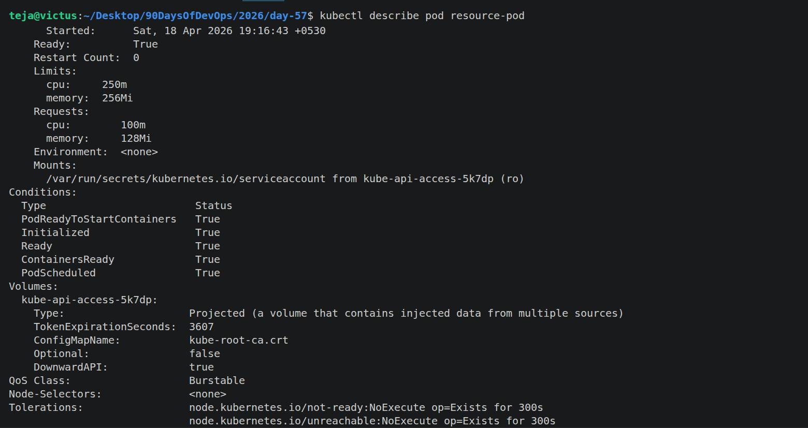
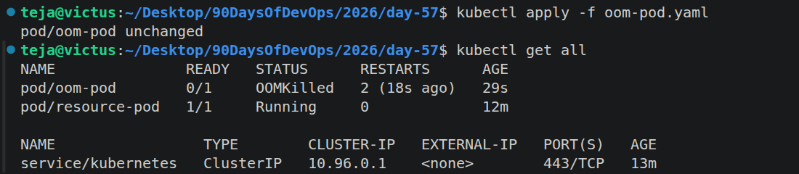
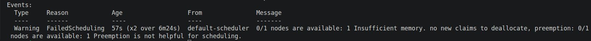
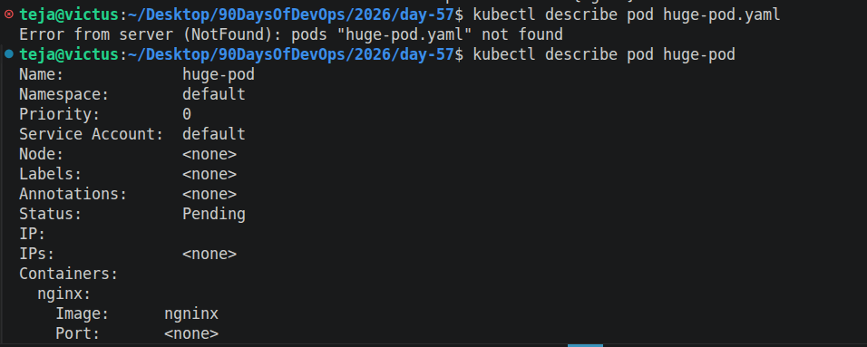
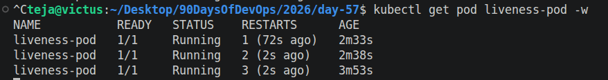
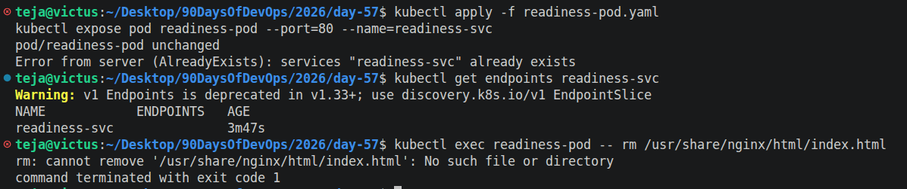
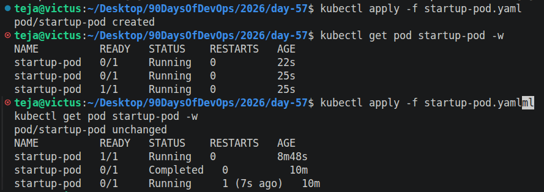

# Day 57 – Resource Requests, Limits, and Probes

## Task
Your Pods are running, but Kubernetes has no idea how much CPU or memory they need — and no way to tell if they are actually healthy. Today you set resource requests and limits for smart scheduling, then add probes so Kubernetes can detect and recover from failures automatically.

---

## Challenge Tasks

### Task 1: Resource Requests and Limits
1. Write a Pod manifest with `resources.requests` (cpu: 100m, memory: 128Mi) and `resources.limits` (cpu: 250m, memory: 256Mi)
2. Apply and inspect with `kubectl describe pod` — look for the Requests, Limits, and QoS Class sections
3. Since requests and limits differ, the QoS class is `Burstable`. If equal, it would be `Guaranteed`. If missing, `BestEffort`.

CPU is in millicores: `100m` = 0.1 CPU. Memory is in mebibytes: `128Mi`.

**Requests** = guaranteed minimum (scheduler uses this for placement). **Limits** = maximum allowed (kubelet enforces at runtime).

**Verify:** What QoS class does your Pod have?

```yaml
---
apiVersion: v1
kind: Pod
metadata:
  name: resource-pod
spec:
  containers:
  - name: nginx
    image: nginx
    resources:
      requests:
        memory: "128Mi"
        cpu: "100m"
      limits:
        memory: "256Mi"
        cpu: "250m"
```



---

### Task 2: OOMKilled — Exceeding Memory Limits
1. Write a Pod manifest using the `polinux/stress` image with a memory limit of `100Mi`
2. Set the stress command to allocate 200M of memory: `command: ["stress"] args: ["--vm", "1", "--vm-bytes", "200M", "--vm-hang", "1"]`
3. Apply and watch — the container gets killed immediately

CPU is throttled when over limit. Memory is killed — no mercy.

Check `kubectl describe pod` for `Reason: OOMKilled` and `Exit Code: 137` (128 + SIGKILL).

**Verify:** What exit code does an OOMKilled container have?
```yaml
---
apiVersion: v1
kind: Pod
metadata:
  name: oom-pod
spec:
  containers:
  - name: stress
    image: polinux/stress
    resources:
      limits:
        memory: "100Mi"
    command: ["stress"] 
    args: ["--vm", "1", "--vm-bytes", "200M", "--vm-hang", "1"]
```



---

### Task 3: Pending Pod — Requesting Too Much
1. Write a Pod manifest requesting `cpu: 100` and `memory: 128Gi`
2. Apply and check — STATUS stays `Pending` forever
3. Run `kubectl describe pod` and read the Events — the scheduler says exactly why: insufficient resources

**Verify:** What event message does the scheduler produce?


```yaml
---
apiVersion: v1
kind: Pod
metadata:
  name: huge-pod
spec:
  containers:
  - name: nginx
    image: ngninx
    resources:
      limits:
        cpu: "100m"
        memory: "128Gi"
```


---

### Task 4: Liveness Probe
A liveness probe detects stuck containers. If it fails, Kubernetes restarts the container.

1. Write a Pod manifest with a busybox container that creates `/tmp/healthy` on startup, then deletes it after 30 seconds
2. Add a liveness probe using `exec` that runs `cat /tmp/healthy`, with `periodSeconds: 5` and `failureThreshold: 3`
3. After the file is deleted, 3 consecutive failures trigger a restart. Watch with `kubectl get pod -w`

**Verify:** How many times has the container restarted?


```yaml
---
apiVersion: v1
kind: Pod
metadata:
  name: liveness-pod
spec:
  containers:
  - name: busybox
    image: busybox
    command:
    - /bin/sh
    - -c
    - touch /tmp/healthy; sleep 30; rm -f /tmp/healthy; sleep 600
    livenessProbe:
      exec:
        command:
        - cat
        - /tmp/healthy
      initialDelaySeconds: 5
      periodSeconds: 5
      failureThreshold: 3
```



---

### Task 5: Readiness Probe
A readiness probe controls traffic. Failure removes the Pod from Service endpoints but does NOT restart it.

1. Write a Pod manifest with nginx and a `readinessProbe` using `httpGet` on path `/` port `80`
2. Expose it as a Service: `kubectl expose pod <name> --port=80 --name=readiness-svc`
3. Check `kubectl get endpoints readiness-svc` — the Pod IP is listed
4. Break the probe: `kubectl exec <pod> -- rm /usr/share/nginx/html/index.html`
5. Wait 15 seconds — Pod shows `0/1` READY, endpoints are empty, but the container is NOT restarted

**Verify:** When readiness failed, was the container restarted?

```yaml

---
apiVersion: v1
kind: Pod
metadata:
  name: readiness-pod
  labels:
    app: readiness-test
spec:
  containers:
  - name: nginx
    image: nginx
    readinessProbe:
      httpGet:
        path: /
        port: 80
      periodSeconds: 5
```



---

### Task 6: Startup Probe
A startup probe gives slow-starting containers extra time. While it runs, liveness and readiness probes are disabled.

1. Write a Pod manifest where the container takes 20 seconds to start (e.g., `sleep 20 && touch /tmp/started`)
2. Add a `startupProbe` checking for `/tmp/started` with `periodSeconds: 5` and `failureThreshold: 12` (60 second budget)
3. Add a `livenessProbe` that checks the same file — it only kicks in after startup succeeds

**Verify:** What would happen if `failureThreshold` were 2 instead of 12?

```yaml
---
apiVersion: v1
kind: Pod
metadata:
  name: startup-pod
spec:
  containers:
    - name: busybox
      image: busybox
      command:
        - /bin/sh
        - -c
        - sleep 20; touch /tmp/started; sleep 600
      startupProbe:
        exec:
          command:
          - cat
          - /tmp/started
        periodSeconds: 5
        failureThreshold: 12
      livenessProbe:
        exec:
          command:
          - cat
          - /tmp/started
        periodSeconds: 5
```



---

### Task 7: Clean Up
Delete all pods and services you created.

```bash
kubectl delete pod --all
kubectl delete service --all
```
---

## Hints
- CPU is compressible (throttled); memory is incompressible (OOMKilled)
- CPU: `1` = 1 core = `1000m`. Memory: `Mi` (mebibytes), `Gi` (gibibytes)
- QoS: Guaranteed (requests == limits), Burstable (requests < limits), BestEffort (none set)
- Probe types: `httpGet`, `exec`, `tcpSocket`
- Liveness failure = restart. Readiness failure = remove from endpoints. Startup failure = kill.
- `initialDelaySeconds`, `periodSeconds`, `failureThreshold` control probe timing
- Exit code 137 = OOMKilled (128 + SIGKILL)

---

## Documentation
Create `day-57-resources-probes.md` with:

## Requests vs limits (scheduling vs enforcement)
Requests are used by scheduler. Limits are enforced at runtime.

## What happens when CPU or memory limits are exceeded
CPU is throttled. Memory causes OOMKilled.

## Liveness Probe
Failure → Restart

## Readiness Probe
Failure → Removed from service, no restart

## Startup Probe
Handles slow apps, prevents premature restart

## QoS Classes
- Guaranteed
- Burstable
- BestEffort

## OOMKilled
Exit Code: 137

## Pending Pod
Reason: insufficient cpu/memory

## Learn in Public
Share on LinkedIn: "Set resource requests and limits in Kubernetes today, watched a pod get OOMKilled, and added liveness, readiness, and startup probes for self-healing."

`#90DaysOfDevOps` `#DevOpsKaJosh` `#TrainWithShubham`

Happy Learning!
**TrainWithShubham**
