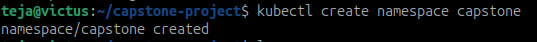
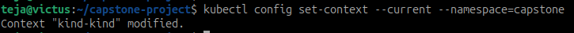
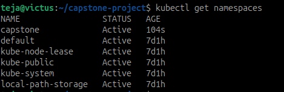
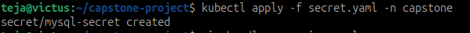
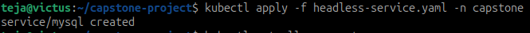
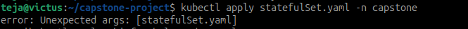
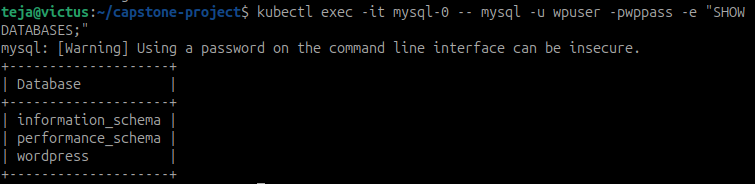
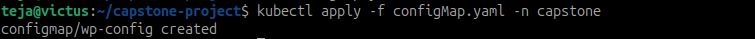
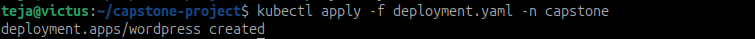
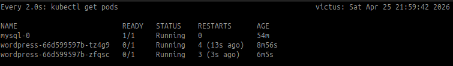

# Day 60 – Capstone: Deploy WordPress + MySQL on Kubernetes

## Task
Ten days of Kubernetes — clusters, Pods, Deployments, Services, ConfigMaps, Secrets, storage, StatefulSets, resource management, autoscaling, and Helm. Today you put it all together. Deploy a real WordPress + MySQL application using every major concept you have learned.

---

## Expected Output
- A complete WordPress + MySQL stack in a `capstone` namespace
- Self-healing and data persistence verified
- A markdown file: `day-60-capstone.md`
- Screenshot of the running WordPress site and `kubectl get all -n capstone`

---

## Challenge Tasks

### Task 1: Create the Namespace (Day 52)
1. Create a `capstone` namespace

2. Set it as your default: `kubectl config set-context --current --namespace=capstone`


---

### Task 2: Deploy MySQL (Days 54-56)
1. Create a Secret with `MYSQL_ROOT_PASSWORD`, `MYSQL_DATABASE`, `MYSQL_USER`, and `MYSQL_PASSWORD` using `stringData`
**secret.yaml**
```yaml
apiVersion: v1
kind: Secret
metadata:
  name: mysql-secret
type: Opaque
stringData:
  MYSQL_ROOT_PASSWORD: rootpass
  MYSQL_DATABASE: wordpress
  MYSQL_USER: wpuser
  MYSQL_PASSWORD: wppass
```


2. Create a Headless Service (`clusterIP: None`) for MySQL on port 3306
**headless-service.yaml**
```yaml
apiVersion: v1
kind: Service
metadata:
  name: mysql
spec:
  clusterIP: None
  ports:
    - port: 3306
  selector:
    app: mysql
```


3. Create a StatefulSet for MySQL with:
   - Image: `mysql:8.0`
   - `envFrom` referencing the Secret
   - Resource requests (cpu: 250m, memory: 512Mi) and limits (cpu: 500m, memory: 1Gi)
   - A `volumeClaimTemplates` section requesting 1Gi of storage, mounted at `/var/lib/mysql`
**statefulSet.yaml**
```yaml
apiVersion: apps/v1
kind: StatefulSet
metadata:
  name: mysql
spec:
  serviceName: mysql
  replicas: 1
  selector:
    matchLabels:
      app: mysql
  template:
    metadata:
      labels:
        app: mysql
    spec:
      containers:
      - name: mysql
        image: mysql:8.0
        envFrom:
        - secretRef:
            name: mysql-secret
        resources:
          requests:
            cpu: "250m"
            memory: "512Mi"
          limits:
            cpu: "500m"
            memory: "1Gi"
        volumeMounts:
        - name: mysql-data
          mountPath: /var/lib/mysql
  volumeClaimTemplates:
  - metadata:
      name: mysql-data
    spec:
      accessModes: ["ReadWriteOnce"]
      resources:
        requests:
          storage: 1Gi
```


4. Verify MySQL works: `kubectl exec -it mysql-0 -- mysql -u <user> -p<password> -e "SHOW DATABASES;"`



**Verify:** Can you see the `wordpress` database?
YES
---

### Task 3: Deploy WordPress (Days 52, 54, 57)
1. Create a ConfigMap with `WORDPRESS_DB_HOST` set to `mysql-0.mysql.capstone.svc.cluster.local:3306` and `WORDPRESS_DB_NAME`

**configMap.yaml**
```yaml
apiVersion: v1
kind: ConfigMap
metadata:
  name: wp-config
data:
  WORDPRESS_DB_HOST: mysql-0.mysql.capstone.svc.cluster.local:3306
  WORDPRESS_DB_NAME: wordpress
```

2. Create a Deployment with 2 replicas using `wordpress:latest` that:
   - Uses `envFrom` for the ConfigMap
   - Uses `secretKeyRef` for `WORDPRESS_DB_USER` and `WORDPRESS_DB_PASSWORD` from the MySQL Secret
   - Has resource requests and limits
   - Has a liveness probe and readiness probe on `/wp-login.php` port 80

```yaml
apiVersion: apps/v1
kind: Deployment
metadata:
  name: wordpress
spec:
  replicas: 2
  selector:
    matchLabels:
      app: wordpress
  template:
    metadata:
      labels:
        app: wordpress
    spec:
      containers:
      - name: wordpress
        image: wordpress:latest
        envFrom:
        - configMapRef:
            name: wp-config
        env:
        - name: WORDPRESS_DB_USER
          valueFrom:
            secretKeyRef:
              name: mysql-secret
              key: MYSQL_USER
        - name: WORDPRESS_DB_PASSWORD
          valueFrom:
            secretKeyRef:
              name: mysql-secret
              key: MYSQL_PASSWORD
        ports:
        - containerPort: 80
        resources:
          requests:
            cpu: "200m"
            memory: "256Mi"
          limits:
            cpu: "500m"
            memory: "512Mi"
        readinessProbe:
          httpGet:
            path: /wp-login.php
            port: 80
          initialDelaySeconds: 20
        livenessProbe:
          httpGet:
            path: /wp-login.php
            port: 80
          initialDelaySeconds: 40
```


3. Wait until both pods show `1/1 Running`

**Verify:** Are both WordPress pods running and ready?

---

### Task 4: Expose WordPress (Day 53)
1. Create a NodePort Service on port 30080 targeting the WordPress pods
2. Access WordPress in your browser:
   - Minikube: `minikube service wordpress -n capstone`
   - Kind: `kubectl port-forward svc/wordpress 8080:80 -n capstone`
3. Complete the setup wizard and create a blog post

**Verify:** Can you see the WordPress setup page?

---

### Task 5: Test Self-Healing and Persistence
1. Delete a WordPress pod — watch the Deployment recreate it within seconds. Refresh the site.
2. Delete the MySQL pod: `kubectl delete pod mysql-0 -n capstone` — watch the StatefulSet recreate it
3. After MySQL recovers, refresh WordPress — your blog post should still be there

**Verify:** After deleting both pods, is your blog post still there?

---

### Task 6: Set Up HPA (Day 58)
1. Write an HPA manifest targeting the WordPress Deployment with CPU at 50%, min 2, max 10 replicas
2. Apply and check: `kubectl get hpa -n capstone`
3. Run `kubectl get all -n capstone` for the complete picture

**Verify:** Does the HPA show correct min/max and target?

---

### Task 7: (Bonus) Compare with Helm (Day 59)
1. Install WordPress using `helm install wp-helm bitnami/wordpress` in a separate namespace
2. Compare: how many resources did each approach create? Which gives more control?
3. Clean up the Helm deployment

---

### Task 8: Clean Up and Reflect
1. Take a final look: `kubectl get all -n capstone`
2. Count the concepts you used: Namespace, Secret, ConfigMap, PVC, StatefulSet, Headless Service, Deployment, NodePort Service, Resource Limits, Probes, HPA, Helm — twelve concepts in one deployment
3. Delete the namespace: `kubectl delete namespace capstone`
4. Reset default: `kubectl config set-context --current --namespace=default`

**Verify:** Did deleting the namespace remove everything?

---

## Hints
- If MySQL takes long to start, check: `kubectl logs mysql-0 -n capstone`
- `WORDPRESS_DB_HOST` must match the StatefulSet DNS pattern: `<pod>.<service>.<namespace>.svc.cluster.local`
- WordPress probes may fail initially — `initialDelaySeconds` gives it time to boot
- If PVC stays Pending, check `kubectl get storageclass`
- `nodePort` must be in range 30000-32767
- The Bitnami chart uses MariaDB instead of MySQL — compatible but not identical

---

## Documentation
Create `day-60-capstone.md` with:
- Architecture of your deployment (which resources connect to which)
- Results of self-healing and persistence tests
- A table mapping each concept to the day you learned it
- Reflection: what was hardest, what clicked, what you would add for production

---

## Submission
1. Add `day-60-capstone.md` to `2026/day-60/`
2. Commit and push to your fork

---

## Learn in Public
Share on LinkedIn: "Completed the Kubernetes capstone — deployed WordPress + MySQL using twelve K8s concepts: Namespaces, Deployments, StatefulSets, Services, ConfigMaps, Secrets, PVCs, resource limits, probes, and HPA. Ten days of learning, one real application."

`#90DaysOfDevOps` `#DevOpsKaJosh` `#TrainWithShubham`

Happy Learning!
**TrainWithShubham**
