# Day 61 -- Introduction to Terraform and Your First AWS Infrastructure

## Task
You have been deploying containers, writing CI/CD pipelines, and orchestrating workloads on Kubernetes. But who creates the servers, networks, and clusters underneath? Today you start your Infrastructure as Code journey with Terraform -- the tool that lets you define, provision, and manage cloud infrastructure by writing code.

By the end of today, you will have created real AWS resources using nothing but a `.tf` file and a terminal.

---

## Expected Output
- Terraform installed and working on your machine
- AWS CLI configured with valid credentials
- An S3 bucket and EC2 instance created and destroyed via Terraform
- A markdown file: `day-61-terraform-intro.md`

---

## Challenge Tasks

### Task 1: Understand Infrastructure as Code

1. What is Infrastructure as Code (IaC)? Why does it matter in DevOps?
- In DevOps, IaC matters because it bridges the gap between development and operations, enabling Continuous Integration/Continuous Delivery (CI/CD) pipelines to automatically deploy infrastructure alongside application code.  This approach eliminates manual errors, prevents environment drift (where development and production settings diverge), and allows teams to rapidly spin up consistent, production-like environments for testing, thereby accelerating deployment cycles and improving system reliability.

2. What problems does IaC solve compared to manually creating resources in the AWS console?
- Key problems resolved include:
- **Configuration Drift:** Manual "quick fixes" in the console cause actual infrastructure to diverge from intended states; IaC enforces the desired state automatically. 
- **Security Gaps:** Manual processes often lead to forgotten parameter changes or misconfigured security groups; IaC enables "shift-left" security validation before deployment. 
- **Operational Debt:** Manual setup is time-consuming and error-prone; IaC automates provisioning, reducing deployment time from days to minutes and enabling rapid disaster recovery.
- **Compliance Failures:** Manual clicks lack the rigorous change management evidence required for standards like SOC 2 or HIPAA; IaC provides a clear Git history of who changed what and why. 
- **Scalability Issues:** Managing resources manually scales exponentially with complexity; IaC scales linearly, allowing identical configurations to be deployed across hundreds of environments effortlessly. 

3. How is Terraform different from AWS CloudFormation, Ansible, and Pulumi?
- Terraform is a cloud-agnostic Infrastructure as Code (IaC) tool that uses HashiCorp Configuration Language (HCL) to provision resources across multiple providers via a declarative approach.  AWS CloudFormation is similar in its declarative, provisioning nature but is limited to AWS resources and uses YAML/JSON. 

- Ansible differs fundamentally as an imperative, agentless configuration management tool that uses SSH to install software and manage settings on existing servers, rather than provisioning the infrastructure itself.  Pulumi is also a multi-cloud IaC tool like Terraform but allows developers to define infrastructure using general-purpose programming languages (e.g., Python, TypeScript) instead of a domain-specific language. 

4. What does it mean that Terraform is "declarative" and "cloud-agnostic"?
- Declarative means that Terraform uses a configuration language (HCL) where you define the desired end state of your infrastructure rather than specifying the exact sequence of steps to achieve it.  Terraform analyzes this desired state, compares it against the current infrastructure, and automatically determines the necessary actions to converge the system to that target, handling dependencies and execution order internally. 

- Cloud-agnostic indicates that Terraform is not tied to a single provider; it can manage resources across AWS, Azure, Google Cloud, Kubernetes, and on-premises environments using a single tool and consistent syntax.  This is achieved through providers, which are plugins that translate Terraform’s declarative configuration into specific API calls for each supported platform, allowing teams to avoid vendor lock-in and manage multi-cloud architectures with unified workflows. 

---

### Task 2: Install Terraform and Configure AWS
1. Install Terraform:
```bash
# macOS
brew tap hashicorp/tap
brew install hashicorp/tap/terraform

# Linux (amd64)
wget -O - https://apt.releases.hashicorp.com/gpg | sudo gpg --dearmor -o /usr/share/keyrings/hashicorp-archive-keyring.gpg
echo "deb [signed-by=/usr/share/keyrings/hashicorp-archive-keyring.gpg] https://apt.releases.hashicorp.com $(lsb_release -cs) main" | sudo tee /etc/apt/sources.list.d/hashicorp.list
sudo apt update && sudo apt install terraform

# Windows
choco install terraform
```

2. Verify:
```bash
terraform -version
```

3. Install and configure the AWS CLI:
```bash
aws configure
# Enter your Access Key ID, Secret Access Key, default region (e.g., ap-south-1), output format (json)
```

4. Verify AWS access:
```bash
aws sts get-caller-identity
```

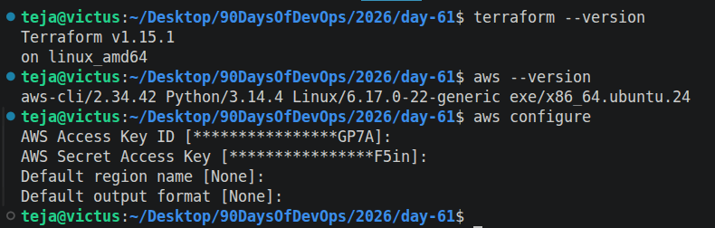

---

### Task 3: Your First Terraform Config -- Create an S3 Bucket
Create a project directory and write your first Terraform config:

```bash
mkdir terraform-basics && cd terraform-basics
```

Create a file called `main.tf` with:
1. A `terraform` block with `required_providers` specifying the `aws` provider
2. A `provider "aws"` block with your region
3. A `resource "aws_s3_bucket"` that creates a bucket with a globally unique name

```bash
terraform {
        required_providers {
                aws = {
                        source = "hashicorp/aws"
                        version = "~> 6.0"
                }
        }
}

# Configure AWS provider
provider aws {
        region = "us-west-1"
}

resource aws_s3_bucket my_s3_bucket {
        bucket = "teja-terraform-demo-unique-12345"

        tags = {
                Name = "my-bucket"
                Environment = "dev"
        }
}
```

Run the Terraform lifecycle:
```bash
terraform init      # Download the AWS provider
terraform plan      # Preview what will be created
terraform apply     # Create the bucket (type 'yes' to confirm)
```
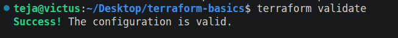
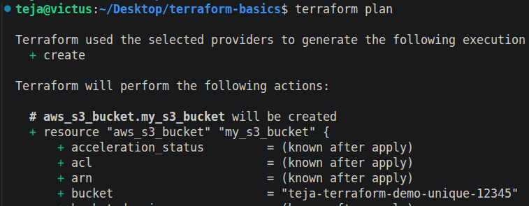
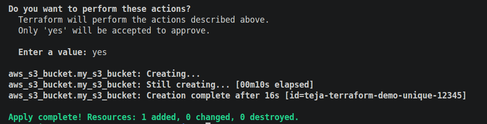

Go to the AWS S3 console and verify your bucket exists.
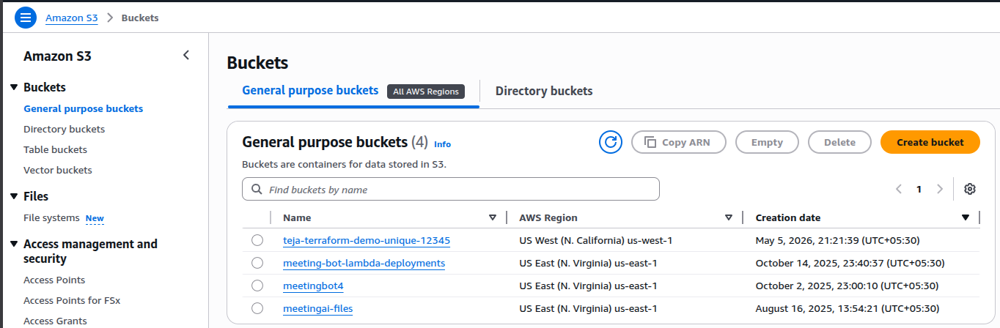


**Document:** What did `terraform init` download? What does the `.terraform/` directory contain?

terraform init downloads: The AWS provider plugin from HashiCorp registry

Specifically:
hashicorp/aws provider (binary executable)

👉 This plugin allows Terraform to:

Communicate with AWS APIs
Create/manage resources like S3, EC2, etc.

---

### Task 4: Add an EC2 Instance
In the same `main.tf`, add:
1. A `resource "aws_instance"` using AMI `ami-0f5ee92e2d63afc18` (Amazon Linux 2 in ap-south-1 -- use the correct AMI for your region)
2. Set instance type to `t2.micro`
3. Add a tag: `Name = "TerraWeek-Day1"`

```bash
resource aws_instance my_instance {
	ami = "ami-0d43f0bb92e485897"
	instance_type = "t3.micro"

	tags = {
		Name = "TerraWeek-Day1"
	}
}
```

Run:
```bash
terraform plan      # You should see 1 resource to add (bucket already exists)
terraform apply
```

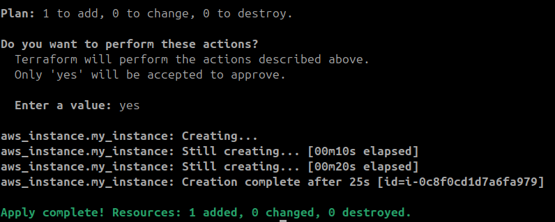

Go to the AWS EC2 console and verify your instance is running with the correct name tag.

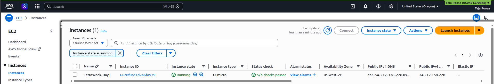

**Document:** How does Terraform know the S3 bucket already exists and only the EC2 instance needs to be created?
Terraform uses a concept called state management.

---

### Task 5: Understand the State File
Terraform tracks everything it creates in a state file. Time to inspect it.

1. Open `terraform.tfstate` in your editor -- read the JSON structure
2. Run these commands and document what each returns:
```bash
terraform show                          # Human-readable view of current state
terraform state list                    # List all resources Terraform manages
terraform state show aws_s3_bucket.<name>   # Detailed view of a specific resource
terraform state show aws_instance.<name>
```

3. Answer these questions in your notes:
- What information does the state file store about each resource?

   - Terraform state stores complete metadata of resources, including:

   - Resource type (e.g., aws_instance)
   - Resource name
   - Unique IDs (e.g., EC2 instance ID)
   - Configuration attributes (AMI, instance type, etc.)
   - Tags
   - Dependencies between resources
   - Provider details

   👉 Essentially:

   - It is Terraform’s source of truth for infrastructure

- Why should you never manually edit the state file?

   - It can corrupt Terraform’s understanding of infrastructure
   - May cause:
      - Duplicate resource creation
      - Resource deletion
      - Drift issues

⚠️ Even a small JSON mistake can break everything

👉 Instead use:
```
terraform state rm
terraform import
terraform state mv
```
- Why should the state file not be committed to Git?
   - Because it contains sensitive data:
      - Resource IDs
      - Public/private IPs
      - Possibly credentials (in some providers)
      - Infrastructure topology

   👉 Risk:

      - Security exposure
      - Infrastructure compromise

   ✔ Best Practice:

      - Use remote backend (S3 + DynamoDB locking)

---

### Task 6: Modify, Plan, and Destroy
1. Change the EC2 instance tag from `"TerraWeek-Day1"` to `"TerraWeek-Modified"` in your `main.tf`
2. Run `terraform plan` and read the output carefully:
   - What do the `~`, `+`, and `-` symbols mean?
   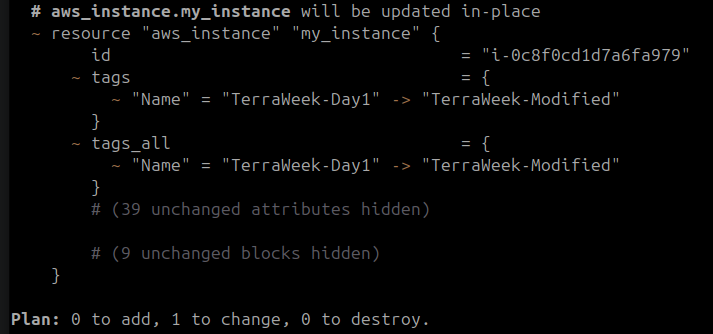
   +, -, ~ represent create, destroy, and update respectively
   - Is this an in-place update or a destroy-and-recreate?
   in-place update
3. Apply the change
   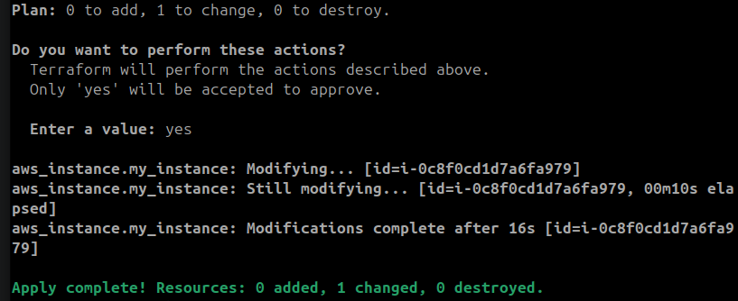
4. Verify the tag changed in the AWS console
   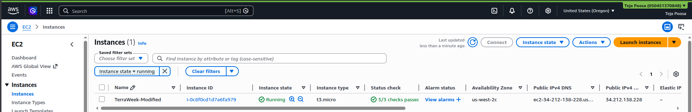
5. Finally, destroy everything:
```bash
terraform destroy
```
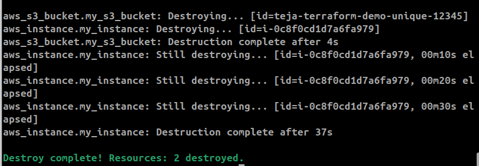
6. Verify in the AWS console -- both the S3 bucket and EC2 instance should be gone

---

## Hints
- S3 bucket names must be globally unique -- use something like `terraweek-<yourname>-2026`
- AMI IDs are region-specific -- search "Amazon Linux 2 AMI" in your region's EC2 launch wizard
- `terraform fmt` auto-formats your `.tf` files -- run it before committing
- `terraform validate` checks for syntax errors without connecting to AWS
- The `.terraform/` directory contains downloaded provider plugins
- Add `*.tfstate`, `*.tfstate.backup`, and `.terraform/` to your `.gitignore`


---

## Learn in Public
Share on LinkedIn: "Started the TerraWeek Challenge -- installed Terraform, created my first S3 bucket and EC2 instance using code, and destroyed it all with one command. Infrastructure as Code just clicked."

`#90DaysOfDevOps` `#TerraWeek` `#DevOpsKaJosh` `#TrainWithShubham`

Happy Learning!
**TrainWithShubham**
