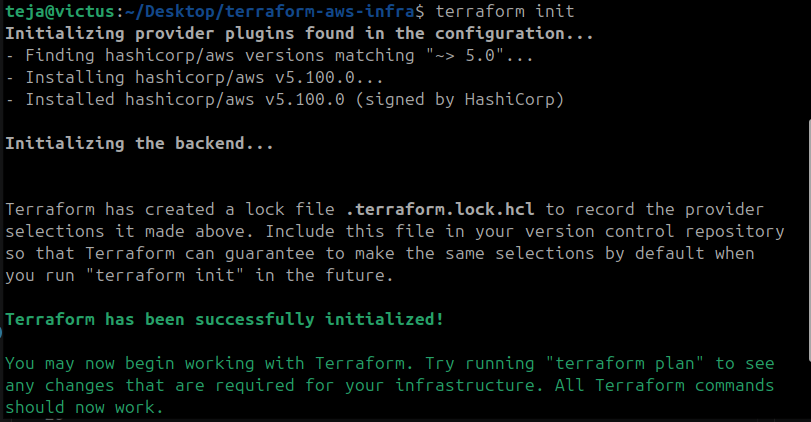
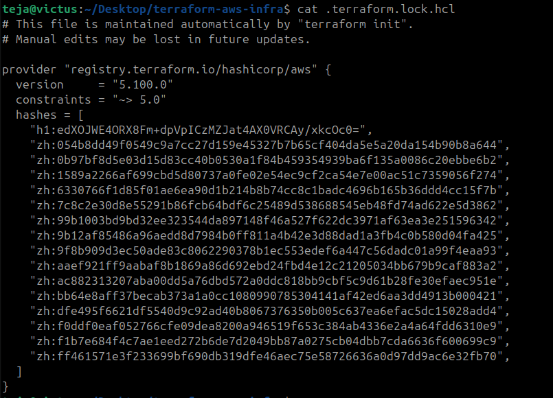
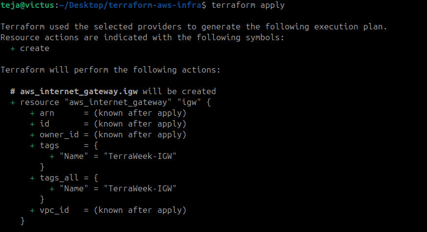
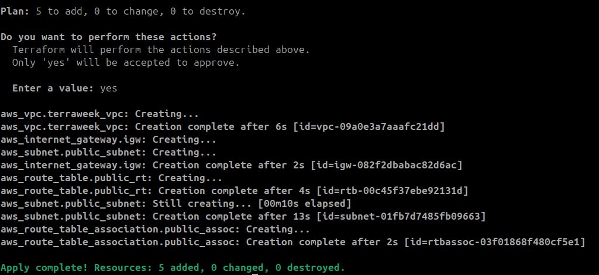
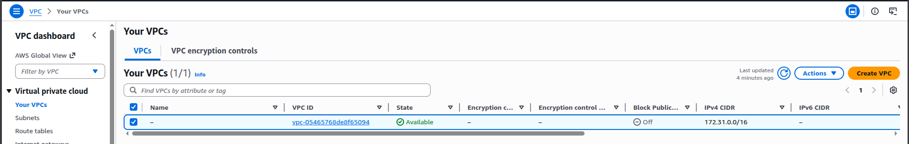
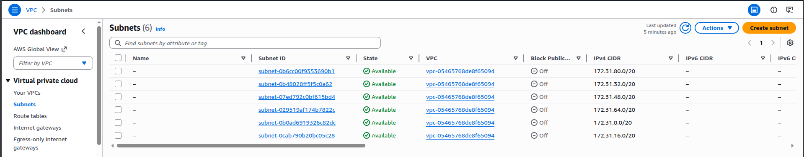
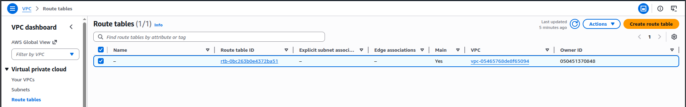

# Day 62 -- Providers, Resources and Dependencies

## Task
Yesterday you created standalone resources. But real infrastructure is connected -- a server lives inside a subnet, a subnet lives inside a VPC, a security group controls what traffic gets in. Today you build a complete networking stack on AWS and learn how Terraform figures out what to create first.

Understanding dependencies is what separates a Terraform beginner from someone who can build production infrastructure.

---

## Expected Output
- A VPC with subnet, internet gateway, route table, security group, and an EC2 instance -- all created via Terraform
- A dependency graph visualized with `terraform graph`
- A markdown file: `day-62-providers-resources.md`

---

## Challenge Tasks

### Task 1: Explore the AWS Provider
1. Create a new project directory: `terraform-aws-infra`
2. Write a `providers.tf` file:
   - Define the `terraform` block with `required_providers` pinning the AWS provider to version `~> 5.0`
   - Define the `provider "aws"` block with your region
3. Run `terraform init` and check the output -- what version was installed?

```
terraform {
	required_providers {
		aws = {
			source = "hashicorp/aws"
			version = "~>5.0"
		}
	}
}

provider aws {
	region = "us-west-1"
}
```


4. Read the provider lock file `.terraform.lock.hcl` -- what does it do?

**Document:** What does `~> 5.0` mean? How is it different from `>= 5.0` and `= 5.0.0`?

---

### Task 2: Build a VPC from Scratch
Create a `main.tf` and define these resources one by one:

1. `aws_vpc` -- CIDR block `10.0.0.0/16`, tag it `"TerraWeek-VPC"`
2. `aws_subnet` -- CIDR block `10.0.1.0/24`, reference the VPC ID from step 1, enable public IP on launch, tag it `"TerraWeek-Public-Subnet"`
3. `aws_internet_gateway` -- attach it to the VPC
4. `aws_route_table` -- create it in the VPC, add a route for `0.0.0.0/0` pointing to the internet gateway
5. `aws_route_table_association` -- associate the route table with the subnet

Run `terraform plan` -- you should see 5 resources to create.




**Verify:** Apply and check the AWS VPC console. Can you see all five resources connected?




---

### Task 3: Understand Implicit Dependencies
Look at your `main.tf` carefully:

1. The subnet references `aws_vpc.main.id` -- this is an implicit dependency
2. The internet gateway references the VPC ID -- another implicit dependency
3. The route table association references both the route table and the subnet

Answer these questions:
- How does Terraform know to create the VPC before the subnet?
   - Terraform builds a dependency graph by analyzing references between resources.
   ```hcl
   vpc_id = aws_vpc.terraweek_vpc.id
   ```
   Here, the subnet is using the ID of the VPC resource.

   **Terraform understands:**

   - aws_subnet.public_subnet needs the VPC ID
   - The VPC ID will only exist after the VPC is created
   - Therefore, VPC must be created first
- What would happen if you tried to create the subnet before the VPC existed?
   - AWS would reject the request because a subnet cannot exist without a VPC.
- Find all implicit dependencies in your config and list them
   - Dependency 1 — Subnet depends on VPC
   - Dependency 2 — Internet Gateway depends on VPC
   - Dependency 3 — Route Table depends on VPC
   - Dependency 4 — Route inside Route Table depends on Internet Gateway
   - Dependency 5 — Route Table Association depends on Subnet
   - Dependency 6 — Route Table Association depends on Route Table

---

### Task 4: Add a Security Group and EC2 Instance
Add to your config:

1. `aws_security_group` in the VPC:
   - Ingress rule: allow SSH (port 22) from `0.0.0.0/0`
   - Ingress rule: allow HTTP (port 80) from `0.0.0.0/0`
   - Egress rule: allow all outbound traffic
   - Tag: `"TerraWeek-SG"`

2. `aws_instance` in the subnet:
   - Use Amazon Linux 2 AMI for your region
   - Instance type: `t2.micro`
   - Associate the security group
   - Set `associate_public_ip_address = true`
   - Tag: `"TerraWeek-Server"`

```hcl
# BUILD a VPC from Scratch

# 1. VPC
resource aws_vpc terraweek_vpc {
	cidr_block = "10.0.0.0/16"
	tags = {
		Name = "TerraWeek-VPC"
	}
}

# 2. Public Subnet
resource aws_subnet public_subnet {
	vpc_id = aws_vpc.terraweek_vpc.id
	map_public_ip_on_launch = true
	cidr_block="10.0.1.0/24"
	tags = {
		Name = "TerraWeek-Public-Subnet"
	}
}

# 3. Internet Gateway
resource aws_internet_gateway igw {
	vpc_id = aws_vpc.terraweek_vpc.id
	
	tags = {
		Name = "TerraWeek-IGW"
	}
}

# 4. Route Table
resource aws_route_table public_rt {
	vpc_id = aws_vpc.terraweek_vpc.id
	
	route {
		cidr_block = "0.0.0.0/0"
		gateway_id = aws_internet_gateway.igw.id
	}

	tags = {
		Name = "TerraWeek-Public-RT"
	}
}

# 5. Route Table Association
resource aws_route_table_association public_assoc {
	subnet_id = aws_subnet.public_subnet.id
	route_table_id = aws_route_table.public_rt.id
}

# 6. Security Group
resource aws_security_group terraweek_sg {
	name = "terraweek-sg"
	description = "Allow SSH and HTTP"
	vpc_id = aws_vpc.terraweek_vpc.id

	# SSH Access
	ingress {
		description= "SSH"
		from_port = 22
		to_port = 22
		protocol = "tcp"
		cidr_blocks = ["0.0.0.0/0"]
	}
	
	# HTTP Acess
	ingress {
		description = "HTTP"
		from_port = 80
		to_port = 80
		protocol = "tcp"
		cidr_blocks = ["0.0.0.0/0"]
	}

	# Outbound Traffic
	egress {
		from_port = 0
		to_port = 0
		protocol = "-1"
		cidr_blocks = ["0.0.0.0/0"]
	}
	
	tags = {
		Name = "TerraWeek-SG"
	}
}

# 7. EC2 Instance
resource aws_instance terraweek_server {
	ami = "ami-0d43f0bb92e485897"
	instance_type = "t3.micro"
   subnet_id = aws_subnet.public_subnet.id
	vpc_security_group_ids = [aws_security_group.terraweek_sg.id]
	associate_public_ip_address = true
	tags = {
		Name = "TerraWeek-Server"
	}
}
```

Apply and verify -- your EC2 instance should have a public IP and be reachable.

---

### Task 5: Explicit Dependencies with depends_on
Sometimes Terraform cannot detect a dependency automatically.

1. Add a second `aws_s3_bucket` resource for application logs
2. Add `depends_on = [aws_instance.main]` to the S3 bucket -- even though there is no direct reference, you want the bucket created only after the instance
3. Run `terraform plan` and observe the order

Now visualize the entire dependency tree:
```bash
terraform graph | dot -Tpng > graph.png
```
If you don't have `dot` (Graphviz) installed, use:
```bash
terraform graph
```
and paste the output into an online Graphviz viewer.

**Document:** When would you use `depends_on` in real projects? Give two examples.

---

### Task 6: Lifecycle Rules and Destroy
1. Add a `lifecycle` block to your EC2 instance:
```hcl
lifecycle {
  create_before_destroy = true
}
```
2. Change the AMI ID to a different one and run `terraform plan` -- observe that Terraform plans to create the new instance before destroying the old one

3. Destroy everything:
```bash
terraform destroy
```
4. Watch the destroy order -- Terraform destroys in reverse dependency order. Verify in the AWS console that everything is cleaned up.

**Document:** What are the three lifecycle arguments (`create_before_destroy`, `prevent_destroy`, `ignore_changes`) and when would you use each?

## Lifecycle Summary Table
| Argument                | Purpose                            | Common Use Case                        |
| ----------------------- | ---------------------------------- | -------------------------------------- |
| `create_before_destroy` | Reduce downtime during replacement | Production servers                     |
| `prevent_destroy`       | Block accidental deletion          | Databases, critical infra              |
| `ignore_changes`        | Ignore external modifications      | Autoscaling, external management tools |


---

## Hints
- `aws_vpc.main.id` syntax: `<resource_type>.<resource_name>.<attribute>`
- Use `terraform fmt` to keep your HCL clean
- CIDR `10.0.0.0/16` gives you 65,536 IPs, `10.0.1.0/24` gives you 256
- If you cannot SSH into the instance, check: security group rules, public IP, route table, internet gateway
- `terraform graph` outputs DOT format -- paste it into webgraphviz.com if you don't have Graphviz
- Always destroy resources when done to avoid AWS charges

---

## Learn in Public
Share on LinkedIn: "Built a complete AWS networking stack with Terraform today -- VPC, subnets, internet gateway, route tables, security groups, and an EC2 instance. All connected through dependency graphs. Terraform decides the order, you define the desired state."

`#90DaysOfDevOps` `#TerraWeek` `#DevOpsKaJosh` `#TrainWithShubham`

Happy Learning!
**TrainWithShubham**
