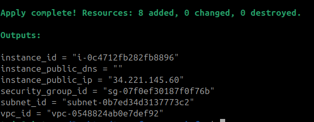
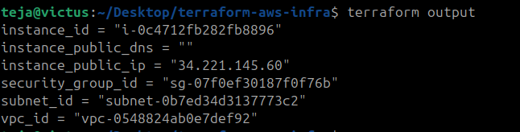
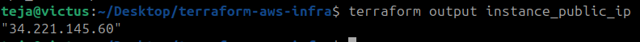

# Day 63 -- Variables, Outputs, Data Sources and Expressions

## Task
Your Day 62 config works, but it is full of hardcoded values -- region, CIDR blocks, AMI IDs, instance types, tags. Change the region and everything breaks. Today you make your Terraform configs dynamic, reusable, and environment-aware.

This is the difference between a config that works once and a config you can use across projects.

---

## Expected Output
- A fully parameterized Terraform config with no hardcoded values
- Separate `.tfvars` files for different environments
- Outputs printed after every apply
- A markdown file: `day-63-variables-outputs.md`

---

## Challenge Tasks

### Task 1: Extract Variables
Take your Day 62 infrastructure config and refactor it:

1. Create a `variables.tf` file with input variables for:
   - `region` (string, default: your preferred region)
   - `vpc_cidr` (string, default: `"10.0.0.0/16"`)
   - `subnet_cidr` (string, default: `"10.0.1.0/24"`)
   - `instance_type` (string, default: `"t2.micro"`)
   - `project_name` (string, no default -- force the user to provide it)
   - `environment` (string, default: `"dev"`)
   - `allowed_ports` (list of numbers, default: `[22, 80, 443]`)
   - `extra_tags` (map of strings, default: `{}`)

2. Replace every hardcoded value in `main.tf` with `var.<name>` references
3. Run `terraform plan` -- it should prompt you for `project_name` since it has no default


### variables.tf
```hcl
variable region { 
	description = "AWS Region"
	type = string
	default = "us-west-2"
	
}

variable vpc_cidr {
	description = "CIDR Block for VPC"
	type = string
	default = "10.0.0.0/16"
}
variable subnet_cidr {
	description = "CIDR Block for Subnet"
	type = string
	default  = "10.0.1.0/24"
}

variable instance_type {
	description = "EC2 instance type"
	type = string
	default = "t2.micro"
}

variable project_name {
	description = "Project Name"
	type = string
}
variable environment {
	description = "Environment name"
	type = string
	default = "dev"
}

variable allowed_ports {
	description = "List of allowed ingress ports"
	type = list(number)
	default = [22, 80, 443]
}

variable extra_tags {
	description = "Additional tags"
	type = map(string)
	
	default = {}
}
```

**Document:** What are the five variable types in Terraform? (`string`, `number`, `bool`, `list`, `map`)

---

### Task 2: Variable Files and Precedence
1. Create `terraform.tfvars`:
```hcl
project_name = "terraweek"
environment  = "dev"
instance_type = "t2.micro"
```

2. Create `prod.tfvars`:
```hcl
project_name = "terraweek"
environment  = "prod"
instance_type = "t3.small"
vpc_cidr     = "10.1.0.0/16"
subnet_cidr  = "10.1.1.0/24"
```

3. Apply with the default file:
```bash
terraform plan                              # Uses terraform.tfvars automatically
```

4. Apply with the prod file:
```bash
terraform plan -var-file="prod.tfvars"      # Uses prod.tfvars
```

5. Override with CLI:
```bash
terraform plan -var="instance_type=t2.nano"  # CLI overrides everything
```

6. Set an environment variable:
```bash
export TF_VAR_environment="staging"
terraform plan                              # env var overrides default but not tfvars
```

**Document:** Write the variable precedence order from lowest to highest priority.

---

### Task 3: Add Outputs
Create an `outputs.tf` file with outputs for:

1. `vpc_id` -- the VPC ID
2. `subnet_id` -- the public subnet ID
3. `instance_id` -- the EC2 instance ID
4. `instance_public_ip` -- the public IP of the EC2 instance
5. `instance_public_dns` -- the public DNS name
6. `security_group_id` -- the security group ID

Apply your config and verify the outputs are printed at the end:
```bash
terraform apply

# After apply, you can also run:
terraform output                          # Show all outputs
terraform output instance_public_ip       # Show a specific output
terraform output -json                    # JSON format for scripting
```

### outputs.tf
```hcl
# VPC ID
output vpc_id {
	description = "ID of the VPC"
	value = aws_vpc.terraweek_vpc.id
}

# Subnet ID
output subnet_id {
	description = "ID of the public subnet"
	value = aws_subnet.public_subnet.id
}

# EC2 Instance ID
output instance_id {
	description = "ID of the EC2 instance"
	value = aws_instance.terraweek_server.id
}

# EC2 Public IP
output instance_public_ip {
	description = "Public IP of EC2 instance"
	value = aws_instance.terraweek_server.public_ip
}

# EC2 Public DNS
output instance_public_dns {
	description = "Public DNS name of EC2 instance"
	value = aws_instance.terraweek_server.public_dns
}

# Security Group ID
output security_group_id {
	description = "ID of security group"
	value = aws_security_group.terraweek_sg.id
}
```



**Verify:** Does `terraform output instance_public_ip` return the correct IP?



---

### Task 4: Use Data Sources
Stop hardcoding the AMI ID. Use a data source to fetch it dynamically.

1. Add a `data "aws_ami"` block that:
   - Filters for Amazon Linux 2 images
   - Filters for `hvm` virtualization and `gp2` root device
   - Uses `owners = ["amazon"]`
   - Sets `most_recent = true`

### main.tf
```hcl
# Fetch latest Amazon Linux 2 AMI
data "aws_ami" "amazon_linux" {
  most_recent = true

  owners = ["amazon"]

  filter {
    name = "name"

    values = ["amzn2-ami-hvm-*-x86_64-gp2"]
  }
  filter {
    name   = "virtualization-type"
    values = ["hvm"]
  }

  filter {
    name   = "root-device-type"
    values = ["ebs"]
  }
}

# Fetch availablity AZs in current region
data "aws_availability_zones" "available" {
  state = "available"
}
```

2. Replace the hardcoded AMI in your `aws_instance` with `data.aws_ami.amazon_linux.id`

3. Add a `data "aws_availability_zones"` block to fetch available AZs in your region

4. Use the first AZ in your subnet: `data.aws_availability_zones.available.names[0]`

Apply and verify -- your config now works in any region without changing the AMI.

**Document:** What is the difference between a `resource` and a `data` source?

Resource vs Data Source
| Feature                       | Resource                       | Data Source                        |
| ----------------------------- | ------------------------------ | ---------------------------------- |
| Purpose                       | Creates/manages infrastructure | Reads existing infrastructure/data |
| Terraform controls lifecycle? | Yes                            | No                                 |
| Creates AWS objects?          | Yes                            | No                                 |
| Example                       | EC2 instance                   | Latest AMI lookup                  |


---

### Task 5: Use Locals for Dynamic Values
1. Add a `locals` block:
```hcl
locals {
  name_prefix = "${var.project_name}-${var.environment}"
  common_tags = {
    Project     = var.project_name
    Environment = var.environment
    ManagedBy   = "Terraform"
  }
}
```

2. Replace all Name tags with `local.name_prefix`:
   - VPC: `"${local.name_prefix}-vpc"`
   - Subnet: `"${local.name_prefix}-subnet"`
   - Instance: `"${local.name_prefix}-server"`

3. Merge common tags with resource-specific tags:
```hcl
tags = merge(local.common_tags, {
  Name = "${local.name_prefix}-server"
})
```

Apply and check the tags in the AWS console -- every resource should have consistent tagging.

---

### Task 6: Built-in Functions and Conditional Expressions
Practice these in `terraform console`:
```bash
terraform console
```

1. **String functions:**
   - `upper("terraweek")` -> `"TERRAWEEK"`
   - `join("-", ["terra", "week", "2026"])` -> `"terra-week-2026"`
   - `format("arn:aws:s3:::%s", "my-bucket")`

2. **Collection functions:**
   - `length(["a", "b", "c"])` -> `3`
   - `lookup({dev = "t2.micro", prod = "t3.small"}, "dev")` -> `"t2.micro"`
   - `toset(["a", "b", "a"])` -> removes duplicates

3. **Networking function:**
   - `cidrsubnet("10.0.0.0/16", 8, 1)` -> `"10.0.1.0/24"`

4. **Conditional expression** -- add this to your config:
```hcl
instance_type = var.environment == "prod" ? "t3.small" : "t2.micro"
```

Apply with `environment = "prod"` and verify the instance type changes.

**Document:** Pick five functions you find most useful and explain what each does.

### Five Most Useful Terraform Functions

1. merge()
Purpose
Combines multiple maps into one.

```
merge(local.common_tags, var.extra_tags)
```
- Why Useful
- Extremely important for:
   - tagging
   - environment configs
   - module defaults

---

2. lookup()
Purpose
Fetch value from map safely.

```
lookup(var.instance_types, "prod")
```
- Why Useful
- Useful for:
   - environment-based configs
   - region mappings
   - feature toggles
---

3. cidrsubnet()
Purpose
Dynamically create subnet CIDRs.
```
cidrsubnet("10.0.0.0/16", 8, 2)
```
- Why Useful
- Critical for:
   - VPC automation
   - multi-AZ architectures
   - scalable networking

---

4. format()
Purpose
Create dynamic formatted strings.
Example:
format("%s-%s-vpc", var.project_name, var.environment)

- Why Useful
- Helpful for:
   - naming conventions
   - ARNs
   - dynamic resource names

---

5. length()
Purpose
Returns collection size.
Example:
```
length(var.allowed_ports)
```
- Why Useful
- Useful for:
   - conditional resource creation
   - loops
   - validation logic

---

Why Terraform Functions Matter
Functions make Terraform:
dynamic
reusable
scalable
environment-aware
- Without functions:
hardcoded infrastructure
With functions:
programmable infrastructure
This is one of Terraform’s biggest strengths as Infrastructure as Code.
---

## Hints
- `terraform.tfvars` is loaded automatically. Any other `.tfvars` file needs `-var-file`
- Variable precedence (low to high): default -> `terraform.tfvars` -> `*.auto.tfvars` -> `-var-file` -> `-var` flag -> `TF_VAR_*` env vars
- `terraform console` is an interactive REPL for testing expressions and functions
- Data sources are read-only -- they fetch information, they don't create resources
- `merge()` combines two maps -- great for tags
- `terraform output -json` is useful when piping output into other scripts

---

## Learn in Public
Share on LinkedIn: "Made my Terraform configs fully dynamic today -- variables for every environment, data sources for AMI lookups, locals for consistent tagging, and conditional expressions for environment-specific sizing. Zero hardcoded values."

`#90DaysOfDevOps` `#TerraWeek` `#DevOpsKaJosh` `#TrainWithShubham`

Happy Learning!
**TrainWithShubham**